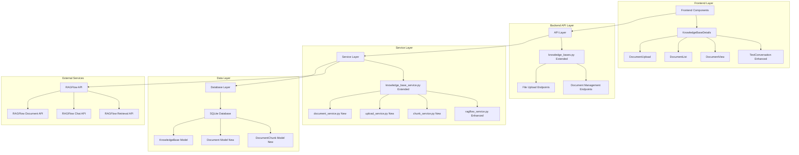
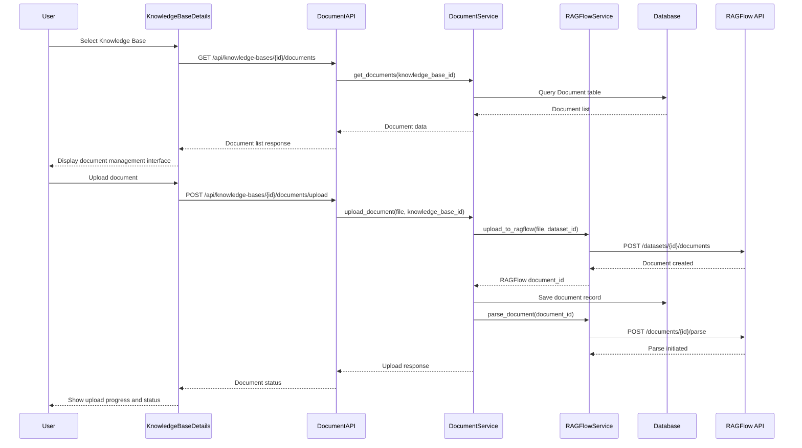
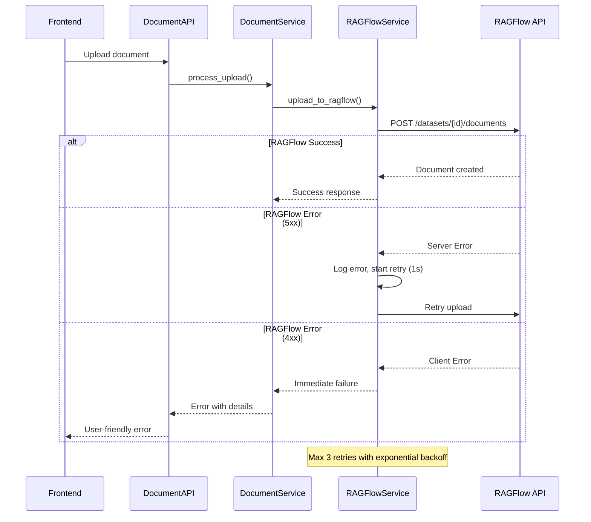

# knowledge-base-document-management - Task 22

Execute task 22 for the knowledge-base-document-management specification.

## Task Description
Create frontend component tests in tests/components/test_document_components.test.tsx

## Code Reuse
**Leverage existing code**: tests/ (existing React testing patterns)

## Requirements Reference
**Requirements**: All frontend requirements

## Usage
```
/Task:22-knowledge-base-document-management
```

## Instructions

Execute with @spec-task-executor agent the following task: "Create frontend component tests in tests/components/test_document_components.test.tsx"

```
Use the @spec-task-executor agent to implement task 22: "Create frontend component tests in tests/components/test_document_components.test.tsx" for the knowledge-base-document-management specification and include all the below context.

# Steering Context
## Steering Documents Context

No steering documents found or all are empty.

# Specification Context
## Specification Context (Pre-loaded): knowledge-base-document-management

### Requirements
# Requirements Document - Knowledge Base Document Management

## Introduction

This feature extends the existing knowledge base system in the Multi-Role Dialogue System (MRC) to provide comprehensive document management capabilities. When users select a knowledge base in the "知识库" tab and access the "测试对话" (Test Conversation) area, they will have access to document management functionality positioned above the test conversation interface. This feature integrates with the existing RAGFlow knowledge base system to allow users to upload, parse, manage, and retrieve documents directly within the MRC application.

## Alignment with Product Vision

This feature supports the MRC product vision by:
- **Enhancing Knowledge Base Capabilities**: Enabling users to directly manage document content within knowledge bases
- **Improving Content Management**: Providing seamless document lifecycle management within the conversation system
- **Strengthening RAGFlow Integration**: Leveraging RAGFlow's document processing capabilities through a unified interface
- **Supporting Multi-Role Dialogues**: Ensuring virtual roles have access to properly managed and up-to-date knowledge sources

## Requirements

### Requirement 1 - Document Upload Management

**User Story:** As a MRC system user with knowledge base access, I want to upload documents to a selected knowledge base, so that I can enrich the knowledge base with relevant content for better conversation responses.

#### Acceptance Criteria

1.1 WHEN a user selects a knowledge base and navigates to the test conversation area THEN the system SHALL display an "上传文档" (Upload Document) interface above the test conversation section, integrated with the existing KnowledgeBaseDetails component
1.2 WHEN a user clicks the upload button or drags files to the upload area THEN the system SHALL support multiple file formats (PDF, DOC, DOCX, TXT, MD, HTML) using existing file validation patterns
1.3 WHEN a user uploads files larger than 50MB THEN the system SHALL reject the upload and display a clear error message using existing error handling utilities
1.4 WHEN document upload is in progress THEN the system SHALL show upload progress with percentage completion updated every second via WebSocket or polling
1.5 WHEN document upload completes successfully THEN the system SHALL add the document to the knowledge base and update the KnowledgeBase model's document_count field
1.6 WHEN concurrent uploads are initiated to the same knowledge base THEN the system SHALL queue uploads and maintain processing order

### Requirement 2 - Document Processing and Parsing

**User Story:** As a MRC system user managing knowledge base content, I want to automatically parse uploaded documents through RAGFlow, so that their content becomes searchable and retrievable.

#### Acceptance Criteria

2.1 WHEN a document is successfully uploaded THEN the system SHALL automatically trigger document parsing through the existing ragflow_service.py RAGFlow API integration
2.2 WHEN document parsing is in progress THEN the system SHALL display processing status with progress indicators using the existing monitoring patterns
2.3 WHEN document parsing fails THEN the system SHALL show error details from RAGFlow API and allow users to retry parsing up to 3 times
2.4 WHEN document parsing completes successfully THEN the system SHALL update document status to "parsed" and make it available for retrieval through knowledge_base_service.py
2.5 IF a document format is not supported by RAGFlow THEN the system SHALL notify the user and suggest supported formats based on RAGFlow API response
2.6 WHEN RAGFlow service is unavailable during parsing THEN the system SHALL queue the document for retry and notify the user

### Requirement 3 - Document Listing and Management

**User Story:** As a MRC system user monitoring knowledge base content, I want to view and manage all documents in a knowledge base, so that I can monitor content status and perform maintenance operations.

#### Acceptance Criteria

3.1 WHEN a user accesses the document management area THEN the system SHALL display a "文档列表" (Document List) showing all documents in the selected knowledge base, extending the existing KnowledgeBaseDetails component
3.2 WHEN the document list is displayed THEN each item SHALL show: filename, file size, upload date, processing status, and available actions, consistent with existing list patterns
3.3 WHEN the user searches for documents by filename THEN the system SHALL filter the list to show matching documents using existing search functionality patterns
3.4 WHEN documents are sorted by upload date, size, or status THEN the system SHALL maintain the selected sort order using existing sorting mechanisms
3.5 WHEN the document count exceeds 20 items THEN the system SHALL implement pagination with 20 items per page using existing pagination components
3.6 WHEN the knowledge base is refreshed or synchronized with RAGFlow THEN the document list SHALL automatically update to reflect current state

### Requirement 4 - Document Deletion

**User Story:** As a MRC system user maintaining knowledge base quality, I want to remove outdated or irrelevant documents, so that I can maintain the quality and relevance of the knowledge base content.

#### Acceptance Criteria

4.1 WHEN a user clicks "删除文档" (Delete Document) on any document THEN the system SHALL show a confirmation dialog with document details using existing confirmation dialog patterns
4.2 WHEN a user confirms document deletion THEN the system SHALL remove the document from both the local database and RAGFlow dataset via ragflow_service.py
4.3 WHEN a document is being processed THEN the system SHALL prevent deletion and show an appropriate message using existing validation patterns
4.4 WHEN document deletion is successful THEN the system SHALL update the document list, refresh the knowledge base statistics in the KnowledgeBase model
4.5 IF document deletion fails due to RAGFlow API errors THEN the system SHALL display the error using existing error handling and offer retry options
4.6 WHEN document deletion affects conversation references THEN the system SHALL gracefully handle missing references in conversation history

### Requirement 5 - Document Chunk Retrieval

**User Story:** As a MRC system user validating knowledge base content, I want to search and retrieve document chunks, so that I can verify content processing and understand how documents are segmented for retrieval.

#### Acceptance Criteria

5.1 WHEN a user selects "检索文档块" (Search Document Chunks) THEN the system SHALL provide a search interface with query input and filters, integrated with existing search patterns
5.2 WHEN a user enters a search query THEN the system SHALL retrieve relevant document chunks using RAGFlow's retrieval API through ragflow_service.py
5.3 WHEN search results are displayed THEN each chunk SHALL show: source document, chunk content, relevance score, and position information
5.4 WHEN search results exceed 10 items THEN the system SHALL implement pagination with configurable result limits (5-50 per page) using existing pagination components
5.5 WHEN no relevant chunks are found THEN the system SHALL display a helpful message and suggest alternative search terms using existing empty state patterns
5.6 WHEN search results include references to documents THEN users SHALL be able to navigate to source document details

### Requirement 6 - Document Chunk Management

**User Story:** As a MRC system user reviewing processed content, I want to access specific document chunks, so that I can review processing results and manage content at a granular level.

#### Acceptance Criteria

6.1 WHEN a user requests "获取文档块" (Get Document Chunks) for a specific document THEN the system SHALL display all chunks from that document, retrieved from RAGFlow API
6.2 WHEN document chunks are displayed THEN each chunk SHALL show: chunk index, content preview, word count, and creation timestamp
6.3 WHEN a user views chunk details THEN the system SHALL provide options to edit chunk metadata or exclude from retrieval through RAGFlow API
6.4 WHEN chunk content is truncated for display THEN the system SHALL provide an expand option to show full content using existing expansion patterns
6.5 IF a document has no processed chunks THEN the system SHALL indicate processing status and suggest appropriate actions
6.6 WHEN chunks are modified or excluded THEN the system SHALL update the knowledge base retrieval behavior accordingly

### Requirement 7 - Integration with Test Conversation

**User Story:** As a MRC system user testing conversations with knowledge bases, I want to see which documents and chunks contributed to responses, so that I can verify the quality and relevance of retrieved information.

#### Acceptance Criteria

7.1 WHEN a test conversation includes knowledge base responses THEN the system SHALL display source document references alongside responses, extending existing TestConversation component
7.2 WHEN document references are displayed THEN users SHALL be able to click to view the contributing document chunks using existing navigation patterns
7.3 WHEN viewing referenced chunks THEN the system SHALL highlight the specific content that was used in the response
7.4 WHEN documents are updated or deleted THEN the system SHALL refresh the test conversation to reflect current knowledge base state
7.5 IF referenced documents are no longer available THEN the system SHALL indicate missing references in conversation history using existing error handling
7.6 WHEN document references are displayed THEN they SHALL include relevance scores and confidence metrics from RAGFlow

## Non-Functional Requirements

### Performance
- Document upload progress shall update at least once per second using WebSocket or polling mechanisms
- Document list loading shall complete within 2 seconds for up to 100 documents using existing caching patterns
- Document chunk search results shall return within 3 seconds for queries up to 500 characters through RAGFlow API optimization
- File upload shall support concurrent uploads of up to 5 files simultaneously with proper queue management
- Document processing status shall be cached to reduce RAGFlow API calls and improve response times

### Security
- Uploaded files shall be validated for type and size before processing using existing validation utilities
- Document access shall be restricted to users with appropriate knowledge base permissions following existing authorization patterns
- File content shall be scanned for malicious content before processing using existing security middleware
- All document operations shall be logged for audit purposes using existing logging infrastructure
- RAGFlow API keys and credentials shall be securely managed using existing configuration patterns

### Reliability
- Document processing failures shall be automatically retried up to 3 times using existing retry mechanisms
- System shall maintain data consistency between local database and RAGFlow through proper transaction management
- Document uploads shall resume automatically after temporary network interruptions using existing error recovery patterns
- Failed operations shall provide clear error messages and recovery suggestions using existing error handling
- System shall handle RAGFlow service outages gracefully with proper fallback and notification mechanisms

### Usability
- Document management interface shall be accessible above the test conversation area without requiring navigation away from current context
- All operations shall provide clear visual feedback and progress indicators using existing UI patterns
- Error messages shall be user-friendly with specific guidance for resolution using existing error messaging
- Interface shall be responsive and functional on screen sizes down to 1024x768 pixels using existing responsive design
- Loading states and progress indicators shall be consistent with existing application patterns

### Integration
- All document operations shall integrate seamlessly with existing RAGFlow API endpoints through ragflow_service.py
- Document management shall maintain consistency with existing knowledge base workflows and knowledge_base_service.py
- New features shall not disrupt existing test conversation or role management functionality
- System shall handle RAGFlow service interruptions gracefully with appropriate user notifications
- Document operations shall follow existing API response patterns and error handling conventions

---

### Design
# Design Document - Knowledge Base Document Management

## Overview

This feature extends the existing knowledge base system in the Multi-Role Dialogue System (MRC) to provide comprehensive document management capabilities. The design builds upon the existing RAGFlow integration, service layer architecture, and React component patterns to add document upload, processing, management, and retrieval functionality above the existing test conversation interface. The implementation leverages the existing KnowledgeBase model, KnowledgeBaseDetails component, and knowledge_base_service.py architecture while introducing new document-specific components and services.

## Steering Document Alignment

### Technical Standards (tech.md)
The design follows established MRC technical patterns:
- **Service Layer Pattern**: Extends existing `knowledge_base_service.py` and `ragflow_service.py` with new document-specific services
- **Database Patterns**: Uses existing SQLAlchemy models and migration scripts for new document tables
- **API Architecture**: Follows RESTful patterns established in `knowledge_bases.py` with consistent error handling
- **Frontend Architecture**: Builds on existing React components with TypeScript interfaces and Tailwind CSS styling
- **Error Handling**: Utilizes existing error utilities and RAGFlow API error patterns

### Project Structure (structure.md)
The implementation respects existing project organization:
- **Backend Models**: New models in `backend/app/models/` following existing naming conventions
- **Backend Services**: New services in `backend/app/services/` extending existing patterns
- **Backend API**: New endpoints in `backend/app/api/knowledge_bases.py` maintaining RESTful structure
- **Frontend Components**: New components in `front/src/components/` following existing patterns
- **Frontend API Client**: Extensions to `front/src/api/knowledgeApi.ts` maintaining consistent interfaces

## Code Reuse Analysis

### Existing Components to Leverage
- **KnowledgeBaseDetails.tsx**: Will be extended with document management tabs above test conversation
- **TestConversation.tsx**: Enhanced to show document references and chunk details
- **knowledgeApi.ts**: Extended with document management methods following existing patterns
- **knowledge_base_service.py**: Extended with document operations and RAGFlow integration
- **ragflow_service.py**: Enhanced with document upload, parsing, and chunk retrieval methods
- **Theme System**: Existing Tailwind CSS theme system and Lucide React icons
- **Error Handling**: Existing error utilities and user feedback patterns

### Integration Points
- **KnowledgeBase Model**: Extended with document relationships and statistics
- **RAGFlow API Integration**: Leverages existing authentication and API patterns for document operations
- **Database Schema**: New tables with foreign key relationships to existing knowledge_base table
- **API Endpoints**: New routes under existing `/api/knowledge-bases/{id}/` structure
- **Component State Management**: Extends existing React state patterns with document-specific state

## Architecture

The document management feature follows a layered architecture that integrates seamlessly with the existing MRC system:



### Component Architecture Flow



## Components and Interfaces

### Backend Components

#### DocumentService (backend/app/services/document_service.py)
- **Purpose**: Core document management operations and lifecycle management
- **Interfaces**:
  - `get_documents(knowledge_base_id, filters)` - Retrieve document list with filtering
  - `get_document(document_id)` - Get single document details
  - `delete_document(document_id)` - Remove document from system and RAGFlow
  - `update_document_status(document_id, status)` - Update processing status
  - `sync_with_ragflow(knowledge_base_id)` - Sync documents with RAGFlow dataset
- **Dependencies**: SQLAlchemy models, RAGFlowService, CacheService
- **Reuses**: Existing database session patterns from knowledge_base_service.py, existing error handling utilities

#### UploadService (backend/app/services/upload_service.py)
- **Purpose**: Handle file upload operations with validation and progress tracking
- **Interfaces**:
  - `validate_file(file)` - Validate file type, size, and security
  - `process_upload(file, knowledge_base_id)` - Process file upload with progress tracking
  - `get_upload_status(upload_id)` - Get upload progress and status
- **Dependencies**: Flask file handling, validation utilities, security middleware
- **Reuses**: Existing file validation patterns, security middleware, error handling

#### ChunkService (backend/app/services/chunk_service.py)
- **Purpose**: Manage document chunk retrieval and search operations
- **Interfaces**:
  - `search_chunks(knowledge_base_id, query, filters)` - Search document chunks
  - `get_document_chunks(document_id)` - Get all chunks for a document
  - `get_chunk_details(chunk_id)` - Get detailed chunk information
- **Dependencies**: RAGFlowService, DocumentService, CacheService
- **Reuses**: Existing caching patterns, RAGFlow API integration, search utilities

#### Enhanced RAGFlowService (backend/app/services/ragflow_service.py)
- **Purpose**: Extended RAGFlow integration for document operations
- **New Interfaces**:
  - `upload_document(dataset_id, file)` - Upload file to RAGFlow dataset
  - `parse_document(document_id)` - Trigger document parsing
  - `get_document_chunks(document_id)` - Retrieve processed chunks
  - `delete_document(document_id)` - Remove document from RAGFlow
  - `search_chunks(dataset_id, query)` - Search within document chunks
- **Dependencies**: Existing RAGFlow client, authentication utilities
- **Reuses**: Existing RAGFlow authentication, error handling, retry mechanisms

### Frontend Components

#### DocumentUpload (front/src/components/DocumentUpload.tsx)
- **Purpose**: File upload interface with drag-and-drop and progress tracking
- **Interfaces**:
  - `onFileSelect(files: File[])` - Handle file selection
  - `onUploadProgress(progress: number)` - Display upload progress
  - `onUploadComplete(document: Document)` - Handle successful upload
- **Dependencies**: knowledgeApi, existing UI components, theme system
- **Reuses**: Existing button components, progress indicators, error handling patterns

#### DocumentList (front/src/components/DocumentList.tsx)
- **Purpose**: Document listing with search, filtering, and pagination
- **Interfaces**:
  - `documents: Document[]` - Document data array
  - `onDocumentSelect(document: Document)` - Handle document selection
  - `onDocumentDelete(document: Document)` - Handle document deletion
- **Dependencies**: knowledgeApi, existing list components, search utilities
- **Reuses**: Existing table/list components, pagination patterns, search functionality

#### DocumentView (front/src/components/DocumentView.tsx)
- **Purpose**: Detailed document view with chunk visualization and management
- **Interfaces**:
  - `document: Document` - Document details
  - `chunks: DocumentChunk[]` - Document chunks
  - `onChunkAction(chunk: DocumentChunk, action: string)` - Handle chunk operations
- **Dependencies**: knowledgeApi, existing modal components, visualization utilities
- **Reuses**: Existing modal patterns, detail view layouts, action button components

#### Enhanced KnowledgeBaseDetails (front/src/components/KnowledgeBaseDetails.tsx)
- **Purpose**: Extended knowledge base details with document management tabs
- **Modifications**:
  - Add document management tab above test conversation
  - Integrate document upload, list, and view components
  - Enhance statistics with document metrics
  - Add document-related actions and status indicators
- **Reuses**: Existing tab system, statistics cards, layout patterns, theme system

#### Enhanced TestConversation (front/src/components/TestConversation.tsx)
- **Purpose**: Enhanced test conversation with document references and chunk details
- **Modifications**:
  - Display document references alongside responses
  - Add clickable links to view contributing chunks
  - Highlight specific content used in responses
  - Handle missing document references gracefully
- **Reuses**: Existing conversation display, message formatting, reference handling

### API Client Extensions (front/src/api/knowledgeApi.ts)

#### New Document Management Methods
- `getDocuments(knowledgeBaseId: string, filters?: DocumentFilters): Promise<DocumentList>`
- `uploadDocument(knowledgeBaseId: string, file: File): Promise<UploadResponse>`
- `deleteDocument(knowledgeBaseId: string, documentId: string): Promise<void>`
- `getDocumentChunks(documentId: string): Promise<DocumentChunk[]>`
- `searchChunks(knowledgeBaseId: string, query: string, filters?: ChunkSearchFilters): Promise<ChunkSearchResult>`

## Data Models

### Document Model (backend/app/models/document.py)

```python
class Document(db.Model):
    __tablename__ = 'documents'

    id = db.Column(db.String(36), primary_key=True, default=lambda: str(uuid.uuid4()))
    knowledge_base_id = db.Column(db.String(36), db.ForeignKey('knowledge_bases.id'), nullable=False)
    ragflow_document_id = db.Column(db.String(255), nullable=True)  # RAGFlow document ID
    filename = db.Column(db.String(255), nullable=False)
    original_filename = db.Column(db.String(255), nullable=False)
    file_size = db.Column(db.Integer, nullable=False)
    file_type = db.Column(db.String(50), nullable=False)
    mime_type = db.Column(db.String(100), nullable=False)
    upload_status = db.Column(db.String(20), default='uploading')  # uploading, uploaded, failed
    processing_status = db.Column(db.String(20), default='pending')  # pending, processing, completed, failed
    chunk_count = db.Column(db.Integer, default=0)
    error_message = db.Column(db.Text, nullable=True)
    ragflow_metadata = db.Column(db.JSON, nullable=True)  # RAGFlow response metadata

    created_at = db.Column(db.DateTime, default=datetime.utcnow)
    updated_at = db.Column(db.DateTime, default=datetime.utcnow, onupdate=datetime.utcnow)
    uploaded_at = db.Column(db.DateTime, nullable=True)
    processed_at = db.Column(db.DateTime, nullable=True)

    # Relationships
    knowledge_base = db.relationship('KnowledgeBase', backref='documents')
    chunks = db.relationship('DocumentChunk', backref='document', cascade='all, delete-orphan')
    processing_logs = db.relationship('ProcessingLog', backref='document', cascade='all, delete-orphan')
```

### DocumentChunk Model (backend/app/models/document_chunk.py)

```python
class DocumentChunk(db.Model):
    __tablename__ = 'document_chunks'

    id = db.Column(db.String(36), primary_key=True, default=lambda: str(uuid.uuid4()))
    document_id = db.Column(db.String(36), db.ForeignKey('documents.id'), nullable=False)
    ragflow_chunk_id = db.Column(db.String(255), nullable=True)  # RAGFlow chunk ID
    chunk_index = db.Column(db.Integer, nullable=False)
    content = db.Column(db.Text, nullable=False)
    content_preview = db.Column(db.String(500), nullable=True)  # Preview for list views
    word_count = db.Column(db.Integer, default=0)
    character_count = db.Column(db.Integer, default=0)

    # Metadata from RAGFlow
    ragflow_metadata = db.Column(db.JSON, nullable=True)  # RAGFlow chunk metadata
    embedding_vector_id = db.Column(db.String(255), nullable=True)  # RAGFlow embedding reference
    position_start = db.Column(db.Integer, nullable=True)  # Position in document
    position_end = db.Column(db.Integer, nullable=True)

    created_at = db.Column(db.DateTime, default=datetime.utcnow)
    updated_at = db.Column(db.DateTime, default=datetime.utcnow, onupdate=datetime.utcnow)

    # Relationships
    references = db.relationship('ChunkReference', backref='chunk', cascade='all, delete-orphan')
```

### ProcessingLog Model (backend/app/models/processing_log.py)

```python
class ProcessingLog(db.Model):
    __tablename__ = 'processing_logs'

    id = db.Column(db.String(36), primary_key=True, default=lambda: str(uuid.uuid4()))
    document_id = db.Column(db.String(36), db.ForeignKey('documents.id'), nullable=False)
    step = db.Column(db.String(50), nullable=False)  # upload, parse, chunk, index
    status = db.Column(db.String(20), nullable=False)  # pending, running, completed, failed
    progress = db.Column(db.Integer, default=0)  # 0-100 percentage
    message = db.Column(db.Text, nullable=True)
    error_details = db.Column(db.JSON, nullable=True)

    started_at = db.Column(db.DateTime, default=datetime.utcnow)
    completed_at = db.Column(db.DateTime, nullable=True)

    # Relationships
    document = db.relationship('Document', backref='logs')
```

### TypeScript Interfaces (front/src/types/document.ts)

```typescript
export interface Document {
  id: string;
  knowledgeBaseId: string;
  ragflowDocumentId?: string;
  filename: string;
  originalFilename: string;
  fileSize: number;
  fileType: string;
  mimeType: string;
  uploadStatus: 'uploading' | 'uploaded' | 'failed';
  processingStatus: 'pending' | 'processing' | 'completed' | 'failed';
  chunkCount: number;
  errorMessage?: string;
  ragflowMetadata?: Record<string, any>;

  createdAt: string;
  updatedAt: string;
  uploadedAt?: string;
  processedAt?: string;
}

export interface DocumentChunk {
  id: string;
  documentId: string;
  ragflowChunkId?: string;
  chunkIndex: number;
  content: string;
  contentPreview?: string;
  wordCount: number;
  characterCount: number;

  ragflowMetadata?: Record<string, any>;
  embeddingVectorId?: string;
  positionStart?: number;
  positionEnd?: number;

  createdAt: string;
  updatedAt: string;
}

export interface DocumentFilters {
  search?: string;
  status?: string;
  fileType?: string;
  sortBy?: 'filename' | 'uploadDate' | 'fileSize' | 'status';
  sortOrder?: 'asc' | 'desc';
  page?: number;
  limit?: number;
}

export interface ChunkSearchFilters {
  documentId?: string;
  minRelevanceScore?: number;
  maxResults?: number;
}

export interface ChunkSearchResult {
  chunks: DocumentChunk[];
  totalCount: number;
  searchTime: number;
  query: string;
}

export interface UploadResponse {
  documentId: string;
  uploadId: string;
  status: 'started' | 'processing' | 'completed' | 'failed';
  message?: string;
}
```

## Error Handling and Recovery

### Error Scenarios

#### 1. File Upload Errors
- **Scenario**: Invalid file type or size (>50MB)
  - **Handling**: Client-side validation using existing security middleware, server-side validation as fallback
  - **User Impact**: Clear error message with supported formats (PDF, DOC, DOCX, TXT, MD, HTML) and size limits
  - **Retry Strategy**: Immediate feedback, allow re-upload with different file

#### 2. RAGFlow Service Unavailable
- **Scenario**: RAGFlow API timeout or connection failure
  - **Handling**: Queue operations with existing retry patterns from ragflow_service.py, display service status
  - **User Impact**: Graceful degradation with clear status indicators, retry buttons
  - **Retry Strategy**: Exponential backoff (1s, 2s, 4s, 8s, 16s) up to 3 attempts

#### 3. Document Processing Failures
- **Scenario**: Document parsing fails due to corrupted file or unsupported content
  - **Handling**: Detailed error logging with ProcessingLog model, user notification with RAGFlow error details
  - **User Impact**: Clear error message with suggested actions (re-upload, format conversion)
  - **Retry Strategy**: Automatic retry up to 3 times with 30-second intervals

#### 4. Storage Limit Exceeded
- **Scenario**: Knowledge base exceeds storage limits
  - **Handling**: Pre-upload validation using existing knowledge_base_service.py patterns
  - **User Impact**: Clear notification with storage usage and management options
  - **Retry Strategy**: Allow upload after cleanup or suggest contacting administrator

#### 5. Concurrent Operation Conflicts
- **Scenario**: Multiple users modifying same document simultaneously
  - **Handling**: Optimistic locking with version checking in Document model, operation queuing
  - **User Impact**: Transparent conflict resolution with minimal disruption
  - **Retry Strategy**: Automatic conflict resolution with user notification for manual intervention

### RAGFlow API Error Recovery



### Data Consistency Management

- **Transaction Boundaries**: All database operations wrapped in transactions with rollback on RAGFlow failures
- **Sync Validation**: Periodic consistency checks between local Document table and RAGFlow dataset
- **Cleanup Jobs**: Background tasks to clean up orphaned records and failed uploads

## Database Migration and Schema Integration

### Migration Requirements

New database tables will be added using existing migration patterns from the MRC codebase:

#### Migration Script: add_document_management_tables.py
```python
# Follows existing pattern from add_knowledge_base_tables.py
def add_document_management_tables():
    """Add document management tables to existing database"""

    # Create documents table
    db.engine.execute('''
        CREATE TABLE IF NOT EXISTS documents (
            id VARCHAR(36) PRIMARY KEY,
            knowledge_base_id VARCHAR(36) NOT NULL,
            ragflow_document_id VARCHAR(255),
            filename VARCHAR(255) NOT NULL,
            original_filename VARCHAR(255) NOT NULL,
            file_size INTEGER NOT NULL,
            file_type VARCHAR(50) NOT NULL,
            mime_type VARCHAR(100) NOT NULL,
            upload_status VARCHAR(20) DEFAULT 'uploading',
            processing_status VARCHAR(20) DEFAULT 'pending',
            chunk_count INTEGER DEFAULT 0,
            error_message TEXT,
            ragflow_metadata JSON,
            created_at DATETIME DEFAULT CURRENT_TIMESTAMP,
            updated_at DATETIME DEFAULT CURRENT_TIMESTAMP,
            uploaded_at DATETIME,
            processed_at DATETIME,
            FOREIGN KEY (knowledge_base_id) REFERENCES knowledge_bases(id)
        )
    ''')

    # Create document_chunks table
    db.engine.execute('''
        CREATE TABLE IF NOT EXISTS document_chunks (
            id VARCHAR(36) PRIMARY KEY,
            document_id VARCHAR(36) NOT NULL,
            ragflow_chunk_id VARCHAR(255),
            chunk_index INTEGER NOT NULL,
            content TEXT NOT NULL,
            content_preview VARCHAR(500),
            word_count INTEGER DEFAULT 0,
            character_count INTEGER DEFAULT 0,
            ragflow_metadata JSON,
            embedding_vector_id VARCHAR(255),
            position_start INTEGER,
            position_end INTEGER,
            created_at DATETIME DEFAULT CURRENT_TIMESTAMP,
            updated_at DATETIME DEFAULT CURRENT_TIMESTAMP,
            FOREIGN KEY (document_id) REFERENCES documents(id)
        )
    ''')

    # Create processing_logs table
    db.engine.execute('''
        CREATE TABLE IF NOT EXISTS processing_logs (
            id VARCHAR(36) PRIMARY KEY,
            document_id VARCHAR(36) NOT NULL,
            step VARCHAR(50) NOT NULL,
            status VARCHAR(20) NOT NULL,
            progress INTEGER DEFAULT 0,
            message TEXT,
            error_details JSON,
            started_at DATETIME DEFAULT CURRENT_TIMESTAMP,
            completed_at DATETIME,
            FOREIGN KEY (document_id) REFERENCES documents(id)
        )
    ''')

    # Add indexes for performance
    db.engine.execute('CREATE INDEX IF NOT EXISTS idx_documents_kb_id ON documents(knowledge_base_id)')
    db.engine.execute('CREATE INDEX IF NOT EXISTS idx_documents_status ON documents(processing_status)')
    db.engine.execute('CREATE INDEX IF NOT EXISTS idx_chunks_doc_id ON document_chunks(document_id)')
    db.engine.execute('CREATE INDEX IF NOT EXISTS idx_logs_doc_id ON processing_logs(document_id)')
```

### KnowledgeBase Model Extensions

The existing KnowledgeBase model will be extended with new relationships:

```python
# backend/app/models/knowledge_base.py (extension)
class KnowledgeBase(db.Model):
    # ... existing fields ...

    # New relationships for document management
    documents = db.relationship('Document', backref='knowledge_base', lazy='dynamic')

    @property
    def document_count(self):
        """Get total document count"""
        return self.documents.count()

    @property
    def total_document_size(self):
        """Get total size of all documents"""
        result = db.session.query(db.func.sum(Document.file_size)).filter_by(knowledge_base_id=self.id).scalar()
        return result or 0

    def get_processing_status_counts(self):
        """Get counts by processing status"""
        return db.session.query(
            Document.processing_status,
            db.func.count(Document.id).label('count')
        ).filter_by(knowledge_base_id=self.id).group_by(Document.processing_status).all()
```

## API Endpoints Specification

### Extended Knowledge Base API Endpoints

All new endpoints follow the existing RESTful pattern from `knowledge_bases.py`:

```python
# backend/app/api/knowledge_bases.py (extensions)

@ns.route('/<string:knowledge_base_id>/documents')
class DocumentListResource(Resource):
    @ns.expect(document_list_model)
    def get(self, knowledge_base_id):
        """Get documents for a knowledge base"""
        # Leverages existing error handling patterns
        # Integrates with existing knowledge_base_service.py

    @ns.expect(document_upload_model)
    def post(self, knowledge_base_id):
        """Upload document to knowledge base"""
        # Uses existing file validation and security middleware
        # Follows existing response format patterns

@ns.route('/<string:knowledge_base_id>/documents/upload')
class DocumentUploadResource(Resource):
    def post(self, knowledge_base_id):
        """Handle file upload with progress tracking"""
        # Leverages existing upload handling patterns
        # Integrates with ragflow_service.py for RAGFlow upload

@ns.route('/<string:knowledge_base_id>/documents/<string:document_id>')
class DocumentResource(Resource):
    def get(self, knowledge_base_id, document_id):
        """Get document details"""

    def delete(self, knowledge_base_id, document_id):
        """Delete document from system and RAGFlow"""
        # Uses existing transaction patterns for data consistency

@ns.route('/<string:knowledge_base_id>/chunks/search')
class ChunkSearchResource(Resource):
    def post(self, knowledge_base_id):
        """Search document chunks"""
        # Integrates with existing search patterns
        # Leverages existing caching from cache_service.py

@ns.route('/<string:knowledge_base_id>/documents/<string:document_id>/chunks')
class DocumentChunksResource(Resource):
    def get(self, knowledge_base_id, document_id):
        """Get all chunks for a document"""
        # Follows existing pagination patterns
```

## WebSocket Integration for Real-Time Updates

### Progress Tracking Implementation

Real-time progress updates will be implemented using WebSocket patterns consistent with existing MRC architecture:

```python
# backend/app/services/progress_service.py (new)
class ProgressService:
    def __init__(self):
        self.active_uploads = {}  # Track active upload sessions

    def start_upload_tracking(self, upload_id, document_id):
        """Start tracking upload progress"""
        self.active_uploads[upload_id] = {
            'document_id': document_id,
            'progress': 0,
            'status': 'uploading',
            'start_time': datetime.utcnow()
        }

    def update_progress(self, upload_id, progress, status=None):
        """Update and broadcast progress"""
        if upload_id in self.active_uploads:
            self.active_uploads[upload_id]['progress'] = progress
            if status:
                self.active_uploads[upload_id]['status'] = status
            # Broadcast to connected clients via WebSocket
            self.broadcast_progress(upload_id, self.active_uploads[upload_id])
```

### Frontend WebSocket Integration

```typescript
// front/src/hooks/useDocumentProgress.ts (new)
export const useDocumentProgress = (uploadId: string) => {
  const [progress, setProgress] = useState(0);
  const [status, setStatus] = useState('uploading');

  useEffect(() => {
    // Connect to WebSocket for progress updates
    const ws = new WebSocket(`${WS_BASE_URL}/progress/${uploadId}`);

    ws.onmessage = (event) => {
      const data = JSON.parse(event.data);
      setProgress(data.progress);
      setStatus(data.status);
    };

    return () => ws.close();
  }, [uploadId]);

  return { progress, status };
};
```

## Testing Strategy

### Unit Testing
- **Service Layer Testing**: Test document and chunk services with mocked RAGFlow API
- **Model Testing**: Test database models, relationships, and validation rules
- **Component Testing**: Test React components with Jest and React Testing Library
- **API Testing**: Test API endpoints with various scenarios and error conditions

### Integration Testing
- **RAGFlow Integration**: Test document upload, processing, and retrieval with actual RAGFlow instance
- **Database Integration**: Test model relationships, migrations, and data consistency
- **Frontend-Backend Integration**: Test API client integration and error handling
- **File Upload Integration**: Test complete file upload workflow with various file types

### End-to-End Testing
- **Complete Document Lifecycle**: Test upload → process → manage → retrieve workflow
- **User Scenarios**: Test common user workflows and edge cases
- **Performance Testing**: Test with large files and high document counts
- **Error Recovery Testing**: Test system recovery from various failure scenarios

**Note**: Specification documents have been pre-loaded. Do not use get-content to fetch them again.

## Task Details
- Task ID: 22
- Description: Create frontend component tests in tests/components/test_document_components.test.tsx
- Leverage: tests/ (existing React testing patterns)
- Requirements: All frontend requirements

## Instructions
- Implement ONLY task 22: "Create frontend component tests in tests/components/test_document_components.test.tsx"
- Follow all project conventions and leverage existing code
- Mark the task as complete using: claude-code-spec-workflow get-tasks knowledge-base-document-management 22 --mode complete
- Provide a completion summary
```

## Task Completion
When the task is complete, mark it as done:
```bash
claude-code-spec-workflow get-tasks knowledge-base-document-management 22 --mode complete
```

## Next Steps
After task completion, you can:
- Execute the next task using /knowledge-base-document-management-task-[next-id]
- Check overall progress with /spec-status knowledge-base-document-management
