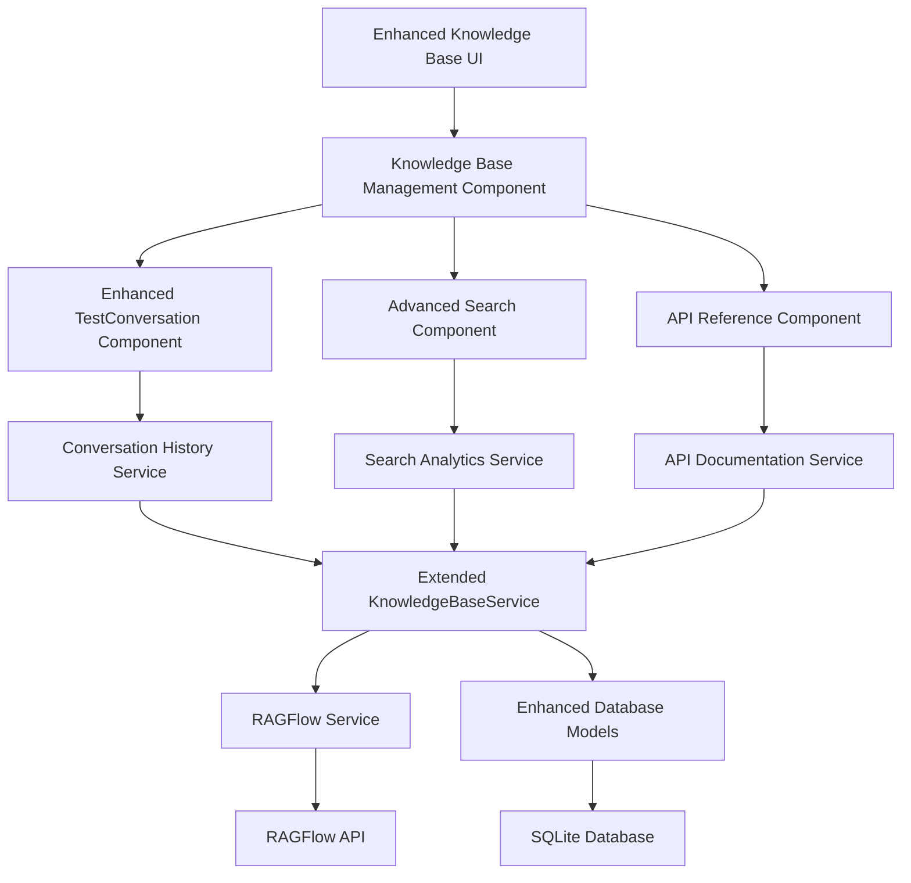
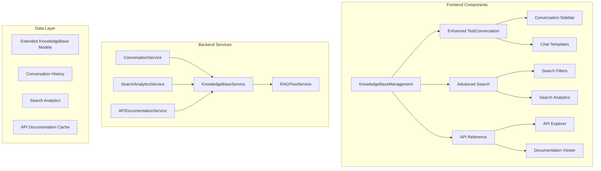

# knowledge-base-ragflow-integration - Task 2.4

Execute task 2.4 for the knowledge-base-ragflow-integration specification.

## Task Description
Extend KnowledgeBaseService in backend/app/services/knowledge_base_service.py

## Code Reuse
**Leverage existing code**: backend/app/services/knowledge

## Requirements Reference
**Requirements**: 4.2, 4.6

## Usage
```
/Task:2.4-knowledge-base-ragflow-integration
```

## Instructions

Execute with @spec-task-executor agent the following task: "Extend KnowledgeBaseService in backend/app/services/knowledge_base_service.py"

```
Use the @spec-task-executor agent to implement task 2.4: "Extend KnowledgeBaseService in backend/app/services/knowledge_base_service.py" for the knowledge-base-ragflow-integration specification and include all the below context.

# Steering Context
## Steering Documents Context

No steering documents found or all are empty.

# Specification Context
## Specification Context (Pre-loaded): knowledge-base-ragflow-integration

### Requirements
# Requirements - Knowledge Base RAGFlow Integration

## Introduction

This feature enhances the existing Knowledge Base tab with advanced RAGFlow-powered chat capabilities, comprehensive search functionality, and integrated API reference documentation. The enhancement builds upon the solid foundation of the existing MRC knowledge base system to provide users with a more powerful and intuitive interface for interacting with their RAGFlow datasets.

The feature will extend the current TestConversation component to include persistent chat history, add advanced search analytics and filtering, and provide an interactive API reference system based on the RAGFlow HTTP API documentation.

## Alignment with Product Vision

This enhancement supports the MRC product vision of providing a comprehensive multi-role dialogue system by:

- **Improving Knowledge Accessibility**: Advanced chat and search capabilities make knowledge base content more discoverable and usable
- **Enhancing User Experience**: Persistent conversations and search history improve workflow efficiency
- **Supporting Development**: API reference integration enables developers to better understand and utilize RAGFlow capabilities
- **Extending Platform Capabilities**: Building on existing architecture to add enterprise-grade knowledge interaction features

## Requirements

### Requirement 1

**User Story:** As a knowledge base researcher, I want to have persistent, searchable conversations with my knowledge bases, so that I can maintain context across sessions and find relevant information from past interactions.

#### Acceptance Criteria

1. WHEN I start a new conversation in the knowledge base chat THEN the system SHALL save the conversation history and allow me to resume previous conversations
2. WHEN I search within my conversation history THEN the system SHALL return relevant conversations with highlighted matching terms
3. WHEN I export a conversation THEN the system SHALL provide options for JSON, Markdown, and PDF formats
4. IF I have multiple ongoing conversations THEN the system SHALL allow me to organize them with tags and categories
5. WHEN I use conversation templates THEN the system SHALL provide pre-defined prompts for common use cases (technical documentation, Q&A, analysis)
6. WHEN the RAGFlow service is temporarily unavailable THEN the system SHALL cache new conversations locally and sync when service is restored
7. WHEN conversation history exceeds 1000 conversations THEN the system SHALL implement pagination and archiving for optimal performance

### Requirement 2

**User Story:** As a knowledge base administrator, I want advanced search functionality with analytics and filtering, so that I can quickly find relevant information and understand usage patterns.

#### Acceptance Criteria

1. WHEN I search for documents THEN the system SHALL provide advanced filters for date ranges, document types, and relevance thresholds
2. WHEN I perform a search THEN the system SHALL display search analytics including popular terms and usage trends
3. IF I save a search query THEN the system SHALL allow me to quickly re-run the search with updated results
4. WHEN I use semantic search THEN the system SHALL provide results ranked by contextual relevance rather than just keyword matching
5. WHEN I view search results THEN the system SHALL show document previews with highlighted matching sections
6. WHEN search results exceed 1000 documents THEN the system SHALL implement pagination with configurable page sizes
7. IF search timeout occurs after 30 seconds THEN the system SHALL provide option to refine search or cancel with partial results

### Requirement 3

**User Story:** As a developer using the MRC system, I want an interactive API reference for RAGFlow endpoints, so that I can understand available capabilities and test integrations directly from the interface.

#### Acceptance Criteria

1. WHEN I access the API reference section THEN the system SHALL display comprehensive documentation for all RAGFlow HTTP API endpoints
2. WHEN I use the API playground THEN the system SHALL allow me to test endpoints with my own API key and view real responses
3. WHEN I view endpoint documentation THEN the system SHALL show request/response examples, parameter descriptions, and error codes
4. IF I need authentication help THEN the system SHALL provide guidance on API key management and setup
5. WHEN I explore the API THEN the system SHALL categorize endpoints by functionality (chat, search, document management, dataset operations)
6. WHEN API requests fail THEN the system SHALL display specific error messages with suggested solutions
7. WHEN testing endpoints THEN the system SHALL enforce rate limiting and validate request parameters before sending

### Requirement 4

**User Story:** As a knowledge base manager, I want the new chat and search features to integrate seamlessly with existing knowledge base management, so that I don't need to learn new interfaces or workflows.

#### Acceptance Criteria

1. WHEN I navigate between knowledge base features THEN the system SHALL maintain consistent navigation and UI patterns
2. WHEN I use enhanced chat features THEN the system SHALL leverage existing knowledge base-role associations and configurations
3. IF I have document uploads in progress THEN the system SHALL show upload status across all knowledge base interface sections
4. WHEN I manage knowledge bases THEN the system SHALL provide unified access to management, chat, search, and API features
5. WHEN I encounter errors THEN the system SHALL provide consistent error handling and user feedback across all features
6. WHEN switching between knowledge bases THEN the system SHALL maintain context for active conversations and search sessions
7. IF existing knowledge base data models require changes THEN the system SHALL ensure backward compatibility with current data

## Non-Functional Requirements

### Performance
- Chat responses shall be displayed within 3 seconds for queries under 1000 tokens
- Search results shall load within 2 seconds for knowledge bases with up to 10,000 documents
- API reference documentation shall load within 1 second
- Conversation history shall support up to 10,000 stored conversations per user

### Security
- API keys shall be encrypted at rest and never exposed in client-side code
- Conversation history shall be isolated by user and knowledge base
- Search analytics shall be aggregated and not expose individual user queries
- API playground shall validate and sanitize all requests

### Reliability
- Chat functionality shall maintain 99.5% uptime during RAGFlow service availability
- Search features shall gracefully degrade when RAGFlow services are temporarily unavailable
- Conversation history shall be backed up regularly and recoverable from failures
- API reference content shall be cached locally for offline access

### Usability
- Enhanced chat interface shall be usable without training for existing TestConversation users
- Advanced search features shall include guided tooltips and examples
- API playground shall provide clear error messages and suggestions
- All new features shall be accessible according to WCAG 2.1 AA standards

---

---

### Design
# Design Document

## Overview

This design document outlines the architectural approach for enhancing the MRC Knowledge Base tab with advanced RAGFlow-powered chat capabilities, comprehensive search functionality, and integrated API reference documentation. The design builds upon the existing solid foundation of the MRC knowledge base system, extending current components and services rather than creating new architectural patterns.

The enhancement focuses on three main areas: extending the TestConversation component for persistent chat functionality, adding advanced search analytics capabilities, and creating an interactive API reference system. All components will integrate seamlessly with the existing KnowledgeBaseManagement interface and maintain architectural consistency with the current MRC system.

## Steering Document Alignment

### Technical Standards (tech.md)
Since no formal tech.md exists, the design aligns with established MRC technical patterns observed in the codebase:
- **Service Layer Pattern**: Following the established KnowledgeBaseService and RAGFlowService architecture
- **Component Composition**: Building on existing React component patterns with TypeScript interfaces
- **RESTful API Design**: Maintaining consistent API endpoint patterns and response structures
- **Database Relationships**: Extending existing SQLAlchemy models with proper relationship definitions
- **Error Handling**: Implementing comprehensive error handling following established patterns

### Project Structure (structure.md)
While no formal structure.md exists, the design respects the observed project organization:
- **Backend Services**: New services will extend existing `backend/app/services/` patterns
- **Frontend Components**: New components will follow `front/src/components/` organization
- **API Endpoints**: New endpoints will extend `backend/app/api/knowledge_bases.py`
- **TypeScript Types**: New interfaces will extend `front/src/types/knowledge.ts`
- **Database Models**: Extensions will follow `backend/app/models/` patterns

## Code Reuse Analysis

### Existing Components to Leverage
- **TestConversation Component** (`front/src/components/TestConversation.tsx`): Extensive chat interface with streaming, reference tracking, and export functionality
- **KnowledgeBaseManagement Component** (`front/src/components/KnowledgeBaseManagement.tsx`): Main navigation and state management for knowledge base features
- **RAGFlowService** (`backend/app/services/ragflow_service.py`): Comprehensive RAGFlow API integration with connection management
- **KnowledgeBaseService** (`backend/app/services/knowledge_base_service.py`): Robust business logic layer with caching and validation
- **API Client** (`front/src/api/knowledgeApi.ts`): TypeScript HTTP client with comprehensive error handling

### Integration Points
- **Knowledge Base Database Models**: Extending `KnowledgeBase` and `KnowledgeBaseConversation` models for conversation persistence
- **RAGFlow API Integration**: Leveraging existing chat and search endpoints for enhanced functionality
- **UI Theme System**: Using existing Tailwind CSS theme and component styling patterns
- **Error Handling Utilities**: Extending existing error handling patterns for new functionality

## Architecture

The enhanced knowledge base system follows a layered architecture that extends the existing MRC patterns:



### Component Architecture



## Components and Interfaces

### Component 1: Enhanced TestConversation Component

**Purpose:** Extend the existing TestConversation component to include persistent conversation history, search capabilities, and conversation management.

**Interfaces:**
```typescript
interface EnhancedTestConversationProps {
  knowledgeBase: KnowledgeBase;
  conversation?: KnowledgeBaseConversation;
  onBack?: () => void;
  onRefreshKnowledgeBase?: () => void;
  showHistory?: boolean;
  enableTemplates?: boolean;
}

interface ConversationHistory {
  id: string;
  title: string;
  knowledgeBaseId: number;
  messages: ChatMessage[];
  tags: string[];
  createdAt: string;
  updatedAt: string;
  metadata: ConversationMetadata;
}

interface ConversationTemplate {
  id: string;
  name: string;
  description: string;
  prompt: string;
  category: 'technical' | 'qa' | 'analysis' | 'custom';
}
```

**Dependencies:**
- TestConversation component (base implementation)
- ConversationService (backend service)
- KnowledgeBaseService (existing)

**Reuses:**
- Existing message rendering and streaming logic
- Reference tracking and display components
- Export functionality (JSON, Markdown)
- Existing error handling and loading states

### Component 2: Advanced Search Component

**Purpose:** Provide comprehensive search functionality with analytics, advanced filtering, and usage tracking.

**Interfaces:**
```typescript
interface AdvancedSearchProps {
  knowledgeBase: KnowledgeBase;
  onSearchResults: (results: SearchResult[]) => void;
}

interface SearchResult {
  id: string;
  title: string;
  content: string;
  relevanceScore: number;
  documentId: string;
  documentName: string;
  chunkId?: string;
  metadata: SearchMetadata;
  highlights: string[];
}

interface SearchAnalytics {
  popularTerms: SearchTermAnalytics[];
  usageTrends: UsageTrendData[];
  searchPerformance: SearchPerformanceMetrics;
  userBehavior: UserSearchBehavior;
}

interface SearchFilters {
  dateRange: {
    startDate: string;
    endDate: string;
  };
  documentTypes: string[];
  relevanceThreshold: number;
  semanticSearch: boolean;
  includeMetadata: boolean;
}
```

**Dependencies:**
- SearchAnalyticsService (backend service)
- RAGFlowService (existing)

**Reuses:**
- Existing search result rendering patterns
- Loading and error state components
- Pagination components
- Filter UI patterns from existing components

### Component 3: API Reference Component

**Purpose:** Interactive API documentation and testing interface for RAGFlow endpoints.

**Interfaces:**
```typescript
interface APIReferenceProps {
  knowledgeBase: KnowledgeBase;
  apiKey?: string;
  onAPIKeyChange?: (key: string) => void;
}

interface APIEndpoint {
  id: string;
  path: string;
  method: 'GET' | 'POST' | 'PUT' | 'DELETE';
  category: 'chat' | 'search' | 'documents' | 'datasets';
  description: string;
  parameters: APIParameter[];
  requestBody?: RequestBodySchema;
  responses: ResponseSchema[];
  examples: APIExample[];
}

interface APIPlaygroundState {
  selectedEndpoint: APIEndpoint;
  requestParams: Record<string, any>;
  requestBody: any;
  response: any;
  isLoading: boolean;
  error: string | null;
}
```

**Dependencies:**
- APIDocumentationService (backend service)
- RAGFlowService (for live API testing)

**Reuses:**
- Existing API client patterns
- Error handling and validation utilities
- Form components and input validation
- Loading and progress indicators

## Data Models

### Extended Knowledge Base Models

```python
# Enhanced KnowledgeBase model
class KnowledgeBase(db.Model):
    __tablename__ = 'knowledge_bases'

    # Existing fields...
    id = db.Column(db.Integer, primary_key=True)
    ragflow_dataset_id = db.Column(db.String(100), nullable=False, unique=True, index=True)
    name = db.Column(db.String(200), nullable=False, index=True)
    description = db.Column(db.Text)
    status = db.Column(db.String(20), nullable=False, default='active', index=True)

    # New fields for enhanced functionality
    conversation_count = db.Column(db.Integer, default=0)
    search_count = db.Column(db.Integer, default=0)
    last_activity = db.Column(db.DateTime, default=datetime.utcnow)
    settings = db.Column(db.JSON, default={})  # Store feature preferences

    # Enhanced relationships
    conversations = db.relationship('ConversationHistory', backref='knowledge_base', lazy='dynamic')
    search_analytics = db.relationship('SearchAnalytics', backref='knowledge_base', lazy='dynamic')

class ConversationHistory(db.Model):
    __tablename__ = 'conversation_history'

    id = db.Column(db.Integer, primary_key=True)
    knowledge_base_id = db.Column(db.Integer, db.ForeignKey('knowledge_bases.id'), nullable=False)
    user_id = db.Column(db.String(100))  # User identifier
    title = db.Column(db.String(200), nullable=False)
    messages = db.Column(db.JSON, nullable=False)  # Conversation messages
    tags = db.Column(db.JSON, default=[])  # Conversation tags
    template_id = db.Column(db.String(100))  # Template used if applicable
    metadata = db.Column(db.JSON, default={})  # Additional metadata
    created_at = db.Column(db.DateTime, default=datetime.utcnow, index=True)
    updated_at = db.Column(db.DateTime, default=datetime.utcnow, onupdate=datetime.utcnow)
    is_archived = db.Column(db.Boolean, default=False, index=True)

    def to_dict(self):
        return {
            'id': self.id,
            'knowledge_base_id': self.knowledge_base_id,
            'title': self.title,
            'messages': self.messages,
            'tags': self.tags,
            'template_id': self.template_id,
            'metadata': self.metadata,
            'created_at': self.created_at.isoformat(),
            'updated_at': self.updated_at.isoformat(),
            'is_archived': self.is_archived
        }

class ConversationTemplate(db.Model):
    __tablename__ = 'conversation_templates'

    id = db.Column(db.Integer, primary_key=True)
    name = db.Column(db.String(100), nullable=False, unique=True)
    description = db.Column(db.Text)
    category = db.Column(db.String(50), nullable=False)  # technical, qa, analysis, custom
    prompt = db.Column(db.Text, nullable=False)
    parameters = db.Column(db.JSON, default=[])  # Template parameters
    is_system = db.Column(db.Boolean, default=False)  # System vs user templates
    usage_count = db.Column(db.Integer, default=0)
    created_at = db.Column(db.DateTime, default=datetime.utcnow)

    def to_dict(self):
        return {
            'id': self.id,
            'name': self.name,
            'description': self.description,
            'category': self.category,
            'prompt': self.prompt,
            'parameters': self.parameters,
            'is_system': self.is_system,
            'usage_count': self.usage_count,
            'created_at': self.created_at.isoformat()
        }

class SearchAnalytics(db.Model):
    __tablename__ = 'search_analytics'

    id = db.Column(db.Integer, primary_key=True)
    knowledge_base_id = db.Column(db.Integer, db.ForeignKey('knowledge_bases.id'), nullable=False)
    user_id = db.Column(db.String(100))
    search_query = db.Column(db.String(500), nullable=False)
    filters = db.Column(db.JSON, default={})
    results_count = db.Column(db.Integer, default=0)
    response_time_ms = db.Column(db.Integer, default=0)
    clicked_documents = db.Column(db.JSON, default=[])  # Document IDs that were clicked
    created_at = db.Column(db.DateTime, default=datetime.utcnow, index=True)

    # Indexes for analytics queries
    __table_args__ = (
        db.Index('idx_search_kb_date', 'knowledge_base_id', 'created_at'),
        db.Index('idx_search_user_date', 'user_id', 'created_at'),
    )

    def to_dict(self):
        return {
            'id': self.id,
            'knowledge_base_id': self.knowledge_base_id,
            'search_query': self.search_query,
            'filters': self.filters,
            'results_count': self.results_count,
            'response_time_ms': self.response_time_ms,
            'clicked_documents': self.clicked_documents,
            'created_at': self.created_at.isoformat()
        }

class APIDocumentationCache(db.Model):
    __tablename__ = 'api_documentation_cache'

    id = db.Column(db.Integer, primary_key=True)
    endpoint_path = db.Column(db.String(200), nullable=False, unique=True)
    method = db.Column(db.String(10), nullable=False)
    category = db.Column(db.String(50), nullable=False)
    documentation = db.Column(db.JSON, nullable=False)  # Cached documentation
    examples = db.Column(db.JSON, default=[])
    last_updated = db.Column(db.DateTime, default=datetime.utcnow)
    is_active = db.Column(db.Boolean, default=True)

    def to_dict(self):
        return {
            'id': self.id,
            'endpoint_path': self.endpoint_path,
            'method': self.method,
            'category': self.category,
            'documentation': self.documentation,
            'examples': self.examples,
            'last_updated': self.last_updated.isoformat(),
            'is_active': self.is_active
        }
```

## Error Handling

### Error Scenarios

1. **RAGFlow Service Unavailable**
   - **Handling:** Implement graceful degradation with local caching and retry logic
   - **User Impact:** Show informative error message with offline mode indicators
   - **Recovery:** Automatic retry with exponential backoff

2. **Conversation History Storage Failure**
   - **Handling:** Local session storage fallback with sync queue
   - **User Impact:** Continue chatting with warning about save issues
   - **Recovery:** Background sync when service restored

3. **Search Performance Degradation**
   - **Handling:** Implement search timeout and result caching
   - **User Impact:** Show loading indicators with cancel option
   - **Recovery:** Fallback to basic keyword search

4. **API Playground Rate Limiting**
   - **Handling:** Local rate limiting with queue management
   - **User Impact:** Show rate limit status and retry countdown
   - **Recovery:** Automatic retry when limit resets

### Error Handling Patterns

```python
# Extended error handling following MRC patterns
class ConversationServiceError(Exception):
    """Base exception for conversation service errors"""
    pass

class ConversationStorageError(ConversationServiceError):
    """Raised when conversation storage fails"""
    pass

class SearchTimeoutError(ConversationServiceError):
    """Raised when search operation times out"""
    pass

class APIRateLimitError(ConversationServiceError):
    """Raised when API rate limit is exceeded"""
    def __init__(self, message, retry_after=None):
        super().__init__(message)
        self.retry_after = retry_after
```

## Testing Strategy

### Unit Testing
- **Service Layer Testing:** Test new service methods (ConversationService, SearchAnalyticsService) with mocked dependencies
- **Component Testing:** Test React components with Jest and React Testing Library
- **Model Testing:** Test database models and relationships
- **API Client Testing:** Test TypeScript API client methods

### Integration Testing
- **API Endpoint Testing:** Test new API endpoints with real database
- **Service Integration:** Test service interactions with RAGFlow service
- **Component Integration:** Test component integration with backend services
- **Database Integration:** Test model relationships and data persistence

### End-to-End Testing
- **User Journey Testing:** Test complete user workflows for enhanced chat, search, and API reference
- **Performance Testing:** Test search and chat performance under load
- **Error Scenario Testing:** Test error handling and recovery scenarios
- **Cross-browser Testing:** Ensure compatibility across browsers

### Testing Framework Integration
- **Backend:** Extend existing pytest configuration and fixtures
- **Frontend:** Use existing Jest setup with additional test utilities
- **Integration Tests:** Leverage existing test database and service mocks
- **E2E Tests:** Use existing test utilities for browser automation

## API Endpoints Specification

### Enhanced Conversation API
```python
# New API endpoints in backend/app/api/knowledge_bases.py

@knowledge_bases_bp.route('/<int:kb_id>/conversations', methods=['GET', 'POST'])
def handle_conversations(kb_id):
    """GET: List conversations, POST: Create new conversation"""
    if request.method == 'GET':
        # Support pagination, filtering, and search
        page = request.args.get('page', 1, type=int)
        per_page = request.args.get('per_page', 20, type=int)
        search = request.args.get('search', '')
        tags = request.args.getlist('tags')

        conversations = conversation_service.get_conversations(
            kb_id, page=page, per_page=per_page,
            search=search, tags=tags
        )

        return {
            'success': True,
            'data': {
                'conversations': [conv.to_dict() for conv in conversations.items],
                'total': conversations.total,
                'page': page,
                'per_page': per_page,
                'pages': conversations.pages
            }
        }

    elif request.method == 'POST':
        # Create new conversation
        data = request.get_json()
        conversation = conversation_service.create_conversation(
            kb_id=kb_id,
            title=data.get('title', 'New Conversation'),
            messages=data.get('messages', []),
            tags=data.get('tags', []),
            template_id=data.get('template_id')
        )

        return {
            'success': True,
            'data': conversation.to_dict()
        }, 201

@knowledge_bases_bp.route('/<int:kb_id>/conversations/<int:conv_id>', methods=['GET', 'PUT', 'DELETE'])
def handle_conversation(kb_id, conv_id):
    """Manage individual conversation"""
    if request.method == 'GET':
        conversation = conversation_service.get_conversation(kb_id, conv_id)
        return {'success': True, 'data': conversation.to_dict()}

    elif request.method == 'PUT':
        data = request.get_json()
        conversation = conversation_service.update_conversation(
            kb_id, conv_id, data
        )
        return {'success': True, 'data': conversation.to_dict()}

    elif request.method == 'DELETE':
        conversation_service.delete_conversation(kb_id, conv_id)
        return {'success': True, 'message': 'Conversation deleted'}

@knowledge_bases_bp.route('/<int:kb_id>/conversations/templates', methods=['GET', 'POST'])
def handle_conversation_templates(kb_id):
    """Manage conversation templates"""
    if request.method == 'GET':
        templates = conversation_service.get_templates(category=request.args.get('category'))
        return {'success': True, 'data': [t.to_dict() for t in templates]}

    elif request.method == 'POST':
        data = request.get_json()
        template = conversation_service.create_template(data)
        return {'success': True, 'data': template.to_dict()}, 201
```

### Advanced Search API
```python
@knowledge_bases_bp.route('/<int:kb_id>/search', methods=['POST'])
def advanced_search(kb_id):
    """Advanced search with analytics tracking"""
    data = request.get_json()

    # Track search analytics
    search_start_time = time.time()

    try:
        # Perform search using existing RAGFlow service
        results = ragflow_service.search_dataset(
            dataset_id=kb.ragflow_dataset_id,
            query=data['query'],
            filters=data.get('filters', {}),
            top_k=data.get('top_k', 10)
        )

        search_time_ms = int((time.time() - search_start_time) * 1000)

        # Record analytics
        search_analytics_service.record_search(
            knowledge_base_id=kb_id,
            user_id=request.headers.get('X-User-ID'),
            search_query=data['query'],
            filters=data.get('filters', {}),
            results_count=len(results.get('results', [])),
            response_time_ms=search_time_ms
        )

        return {
            'success': True,
            'data': {
                'results': results.get('results', []),
                'total': results.get('total', 0),
                'search_time_ms': search_time_ms,
                'query': data['query']
            }
        }

    except Exception as e:
        return {
            'success': False,
            'error': str(e),
            'message': 'Search failed'
        }, 500

@knowledge_bases_bp.route('/<int:kb_id>/search/analytics', methods=['GET'])
def get_search_analytics(kb_id):
    """Get search analytics and usage trends"""
    days = request.args.get('days', 30, type=int)
    analytics = search_analytics_service.get_analytics(kb_id, days=days)

    return {
        'success': True,
        'data': analytics.to_dict()
    }
```

### API Reference Endpoints
```python
@knowledge_bases_bp.route('/api-reference', methods=['GET'])
def get_api_reference():
    """Get RAGFlow API documentation"""
    category = request.args.get('category')
    endpoints = api_doc_service.get_endpoints(category=category)

    return {
        'success': True,
        'data': [ep.to_dict() for ep in endpoints]
    }

@knowledge_bases_bp.route('/api-reference/playground', methods=['POST'])
def api_playground():
    """Test API endpoints with provided parameters"""
    data = request.get_json()

    try:
        # Validate request
        api_doc_service.validate_playground_request(data)

        # Rate limiting check
        if not api_doc_service.check_rate_limit(request.headers.get('X-User-ID')):
            raise APIRateLimitError("Rate limit exceeded", retry_after=60)

        # Execute API call
        result = api_doc_service.execute_endpoint(
            endpoint_path=data['endpoint'],
            method=data['method'],
            parameters=data.get('parameters', {}),
            request_body=data.get('request_body'),
            api_key=data.get('api_key')
        )

        return {
            'success': True,
            'data': {
                'response': result,
                'execution_time_ms': result.get('execution_time_ms', 0),
                'status_code': result.get('status_code', 200)
            }
        }

    except APIRateLimitError as e:
        return {
            'success': False,
            'error': 'RATE_LIMIT_EXCEEDED',
            'message': str(e),
            'retry_after': e.retry_after
        }, 429

    except Exception as e:
        return {
            'success': False,
            'error': str(e),
            'message': 'API call failed'
        }, 500
```

## Database Migration Strategy

### Migration Script: `add_enhanced_features.py`
```python
def add_enhanced_features():
    """Add new tables and columns for enhanced knowledge base features"""

    # Add new columns to knowledge_bases table
    db.engine.execute("""
        ALTER TABLE knowledge_bases
        ADD COLUMN conversation_count INTEGER DEFAULT 0,
        ADD COLUMN search_count INTEGER DEFAULT 0,
        ADD COLUMN last_activity DATETIME DEFAULT CURRENT_TIMESTAMP,
        ADD COLUMN settings JSON DEFAULT '{}'
    """)

    # Create new tables
    db.create_all()

    # Create indexes for performance
    db.engine.execute("""
        CREATE INDEX idx_conversation_kb_created
        ON conversation_history(knowledge_base_id, created_at DESC);

        CREATE INDEX idx_conversation_user_created
        ON conversation_history(user_id, created_at DESC);

        CREATE INDEX idx_search_analytics_kb_date
        ON search_analytics(knowledge_base_id, created_at DESC);

        CREATE INDEX idx_search_analytics_query
        ON search_analytics(search_query);
    """)

    # Populate initial data
    conversation_service.create_system_templates()
    api_doc_service.cache_api_documentation()

    print("Enhanced features migration completed successfully")
```

### Performance Optimization Strategy

### Conversation History Management
- **Pagination**: Implement cursor-based pagination for large conversation lists
- **Archiving**: Automatically archive conversations older than 1 year
- **Compression**: Compress message JSON using gzip for large conversations
- **Indexing**: Strategic indexes on knowledge_base_id, created_at, and user_id

### Search Analytics Optimization
- **Aggregation**: Pre-compute daily/weekly analytics aggregates
- **Partitioning**: Partition search_analytics table by date
- **Retention**: Delete analytics data older than 2 years
- **Caching**: Cache popular analytics queries for 15 minutes

### API Documentation Caching
- **Local Cache**: Cache RAGFlow API documentation locally with 24-hour TTL
- **Delta Updates**: Only update changed documentation
- **Compression**: Compress cached documentation to reduce storage

## Security Considerations

### API Key Management
- **Encryption**: Store API keys using AES-256 encryption
- **Rotation**: Implement automatic API key rotation every 90 days
- **Auditing**: Log all API key usage with timestamps and user IDs
- **Scope Limiting**: Restrict API keys to specific endpoints and rate limits

### Data Privacy
- **Conversation Isolation**: Strict user/knowledge base isolation
- **Analytics Anonymization**: Aggregate analytics data to prevent user identification
- **Data Retention**: Implement configurable data retention policies
- **GDPR Compliance**: Provide data export and deletion capabilities

## Monitoring and Alerting

### Key Metrics
- **Conversation Performance**: Average response time, storage usage
- **Search Performance**: Query latency, result relevance, cache hit rates
- **API Playground Usage**: Request volume, error rates, rate limiting
- **System Health**: Database performance, RAGFlow connectivity

### Alert Configuration
- **High Response Times**: Alert when chat responses exceed 5 seconds
- **Storage Limits**: Alert when conversation storage exceeds 80% capacity
- **Error Rates**: Alert when error rate exceeds 5% over 10 minutes
- **RAGFlow Outages**: Immediate alert on RAGFlow service unavailability

**Note**: Specification documents have been pre-loaded. Do not use get-content to fetch them again.

## Task Details
- Task ID: 2.4
- Description: Extend KnowledgeBaseService in backend/app/services/knowledge_base_service.py
- Leverage: backend/app/services/knowledge
- Requirements: 4.2, 4.6

## Instructions
- Implement ONLY task 2.4: "Extend KnowledgeBaseService in backend/app/services/knowledge_base_service.py"
- Follow all project conventions and leverage existing code
- Mark the task as complete using: claude-code-spec-workflow get-tasks knowledge-base-ragflow-integration 2.4 --mode complete
- Provide a completion summary
```

## Task Completion
When the task is complete, mark it as done:
```bash
claude-code-spec-workflow get-tasks knowledge-base-ragflow-integration 2.4 --mode complete
```

## Next Steps
After task completion, you can:
- Execute the next task using /knowledge-base-ragflow-integration-task-[next-id]
- Check overall progress with /spec-status knowledge-base-ragflow-integration
