# 详细业务工作流程

## 1. 角色管理工作流程

### 1.1 角色创建流程

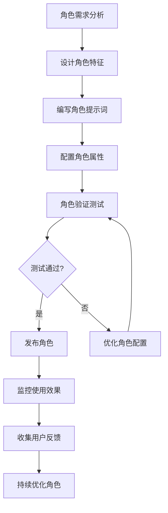

**详细步骤说明:**

#### 步骤 1: 角色需求分析 (1-2 小时)
- **输入**: 业务需求、用户场景分析
- **活动**:
  - 确定角色定位和职责范围
  - 分析目标用户群体和使用场景
  - 定义角色的核心价值主张
- **输出**: 角色需求文档
- **负责人**: 产品经理、业务分析师

#### 步骤 2: 设计角色特征 (2-3 小时)
- **输入**: 角色需求文档
- **活动**:
  - 定义角色的性格特点和说话风格
  - 确定专业能力和知识领域
  - 设计行为约束和边界条件
- **输出**: 角色特征设计文档
- **负责人**: 用户体验设计师、内容专家

#### 步骤 3: 编写角色提示词 (3-4 小时)
- **输入**: 角色特征设计文档
- **活动**:
  - 编写完整的角色设定提示词
  - 包含身份、性格、专业背景等要素
  - 添加行为约束和交互规则
- **输出**: 角色提示词文档
- **负责人**: 内容创作专家、领域专家

#### 步骤 4: 配置角色属性 (1-2 小时)
- **输入**: 角色提示词文档
- **活动**:
  - 在系统中创建角色记录
  - 填写角色名称和提示词
  - 设置角色元数据和标签
- **输出**: 系统中的角色配置
- **负责人**: 系统管理员、内容管理员

#### 步骤 5: 角色验证测试 (2-3 小时)
- **输入**: 角色配置
- **活动**:
  - 创建测试会话验证角色表现
  - 检查角色行为是否符合设计预期
  - 测试角色在不同场景下的表现
- **输出**: 角色测试报告
- **负责人**: 测试人员、产品经理

### 1.2 角色编辑流程

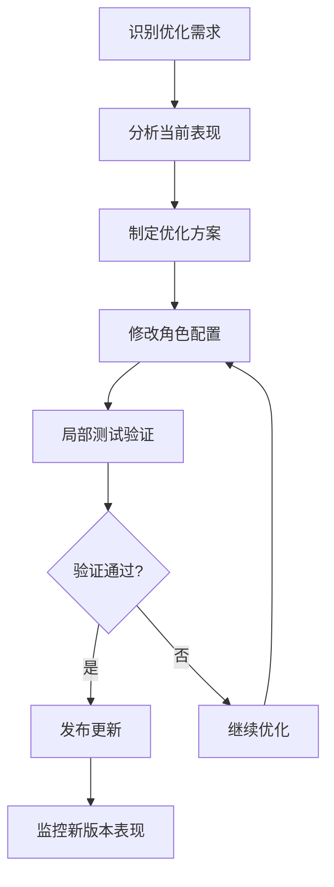

### 1.3 角色删除流程

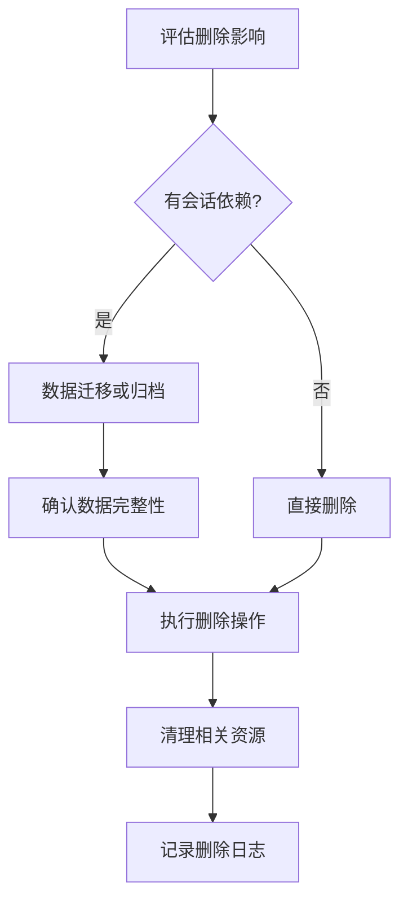

## 2. 流程模板管理工作流程

### 2.1 流程模板设计流程

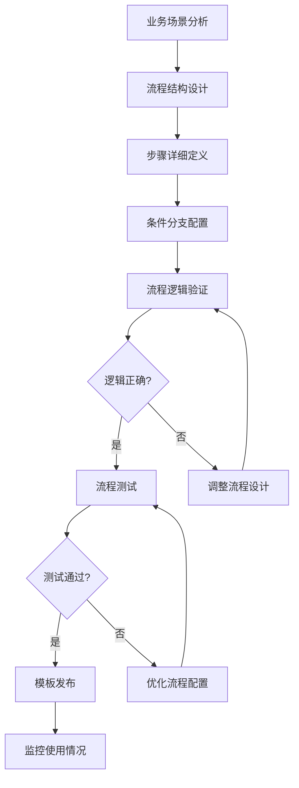

**详细步骤说明:**

#### 步骤 1: 业务场景分析 (2-3 小时)
- **输入**: 业务需求、用户故事
- **活动**:
  - 分析对话场景的具体需求
  - 确定参与角色和职责分工
  - 定义对话流程的目标和约束
- **输出**: 场景分析报告
- **负责人**: 业务分析师、产品经理

#### 步骤 2: 流程结构设计 (3-4 小时)
- **输入**: 场景分析报告
- **活动**:
  - 设计流程的整体架构
  - 确定步骤的执行顺序
  - 规划条件分支和循环结构
- **输出**: 流程结构图
- **负责人**: 业务架构师、流程设计师

#### 步骤 3: 步骤详细定义 (4-6 小时)
- **输入**: 流程结构图
- **活动**:
  - 配置每个步骤的详细信息
  - 设置发言角色和目标角色
  - 定义任务类型和上下文范围
  - 编写步骤描述和说明
- **输出**: 完整的步骤配置
- **负责人**: 流程设计师、内容专家

#### 步骤 4: 条件分支配置 (2-3 小时)
- **输入**: 完整的步骤配置
- **活动**:
  - 设置步骤执行的条件判断
  - 配置分支跳转逻辑
  - 定义异常处理机制
- **输出**: 条件分支配置
- **负责人**: 系统架构师、业务分析师

### 2.2 流程模板测试流程

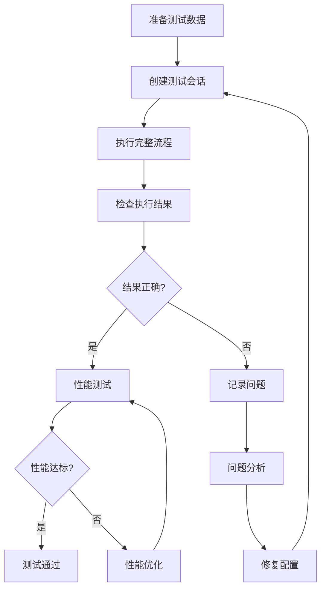

### 2.3 流程模板优化流程

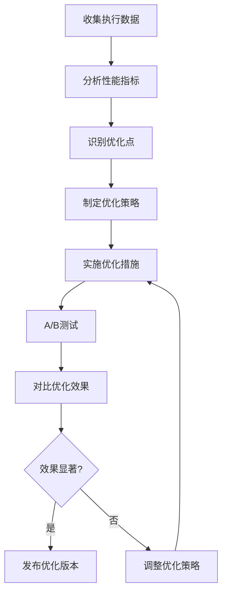

## 3. 会话管理工作流程

### 3.1 会话创建流程

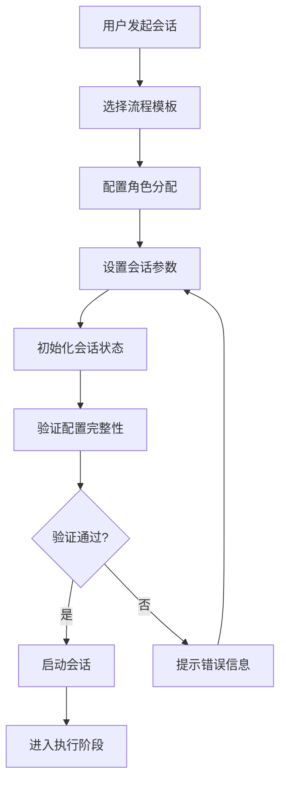

**详细步骤说明:**

#### 步骤 1: 选择流程模板 (1-2 分钟)
- **输入**: 用户需求
- **活动**:
  - 浏览可用流程模板
  - 查看模板详情和预览
  - 选择符合需求的模板
- **输出**: 选定的流程模板
- **负责人**: 最终用户

#### 步骤 2: 配置角色分配 (3-5 分钟)
- **输入**: 流程模板
- **活动**:
  - 为流程中的角色分配具体角色
  - 设置角色的个性化参数
  - 确认角色配置的合理性
- **输出**: 角色分配配置
- **负责人**: 最终用户

#### 步骤 3: 设置会话参数 (1-2 分钟)
- **输入**: 角色分配配置
- **活动**:
  - 设置会话名称和描述
  - 配置执行参数和选项
  - 设置监控和通知选项
- **输出**: 会话参数配置
- **负责人**: 最终用户

### 3.2 会话执行流程

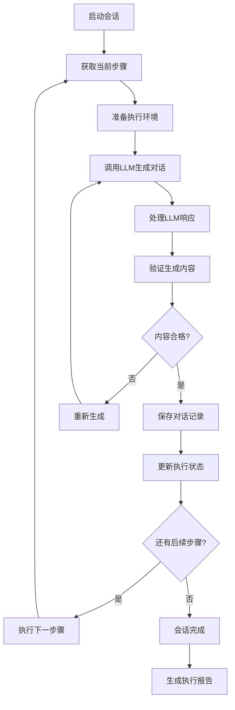

### 3.3 会话监控流程

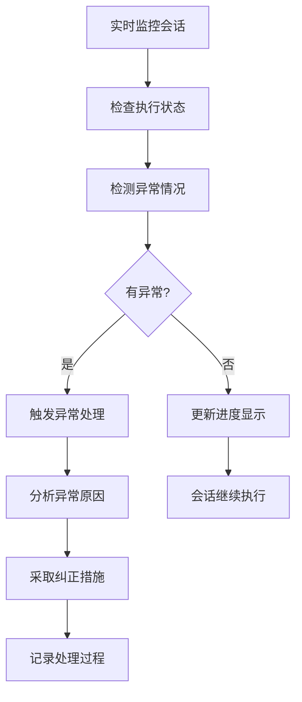

### 3.4 会话管理操作流程

#### 暂停会话流程
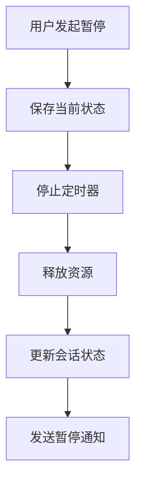

#### 继续会话流程
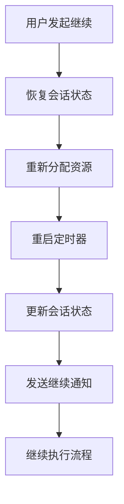

#### 重置会话流程
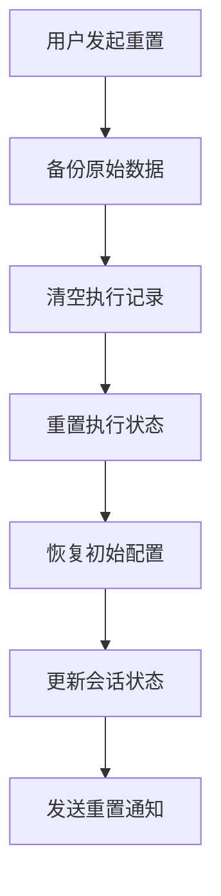

## 4. LLM 集成工作流程

### 4.1 LLM 调用流程

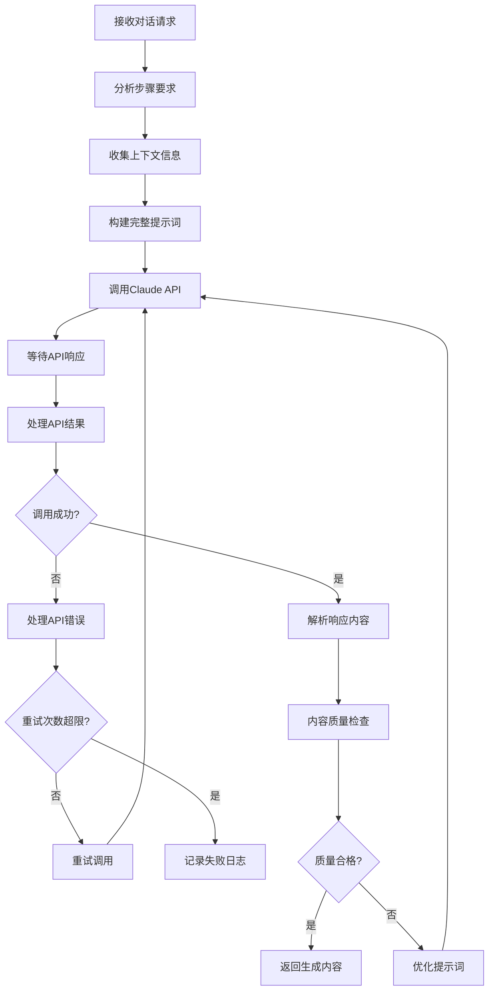

### 4.2 内容质量检查流程

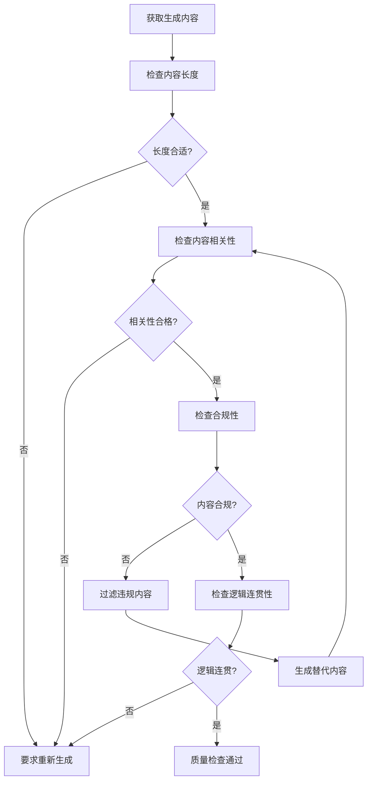

### 4.3 性能监控流程

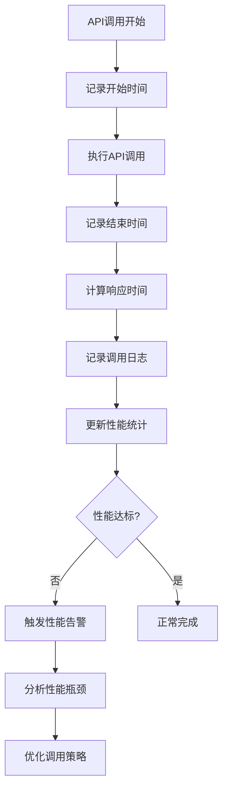

## 5. 数据管理工作流程

### 5.1 数据备份流程

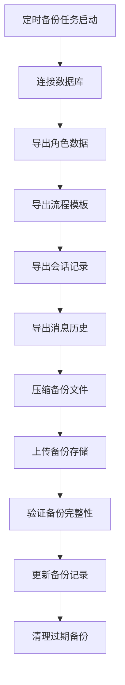

### 5.2 数据恢复流程

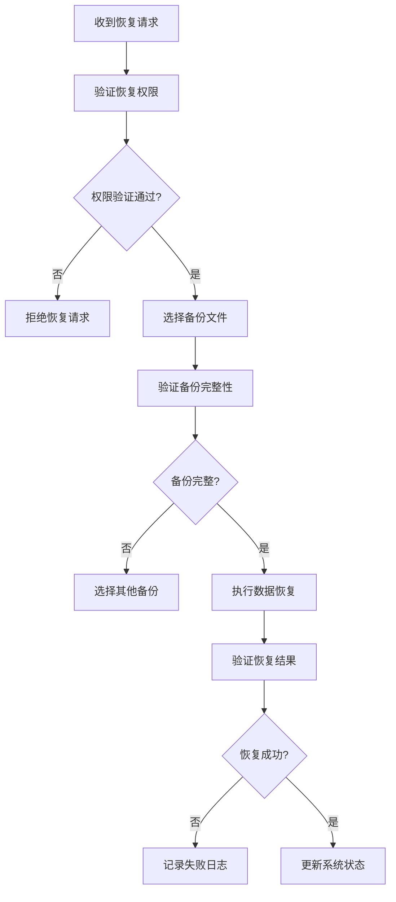

### 5.3 数据清理流程

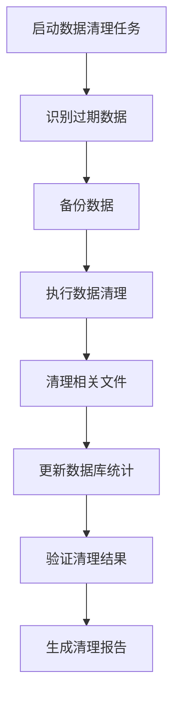

## 6. 系统运维工作流程

### 6.1 系统监控流程

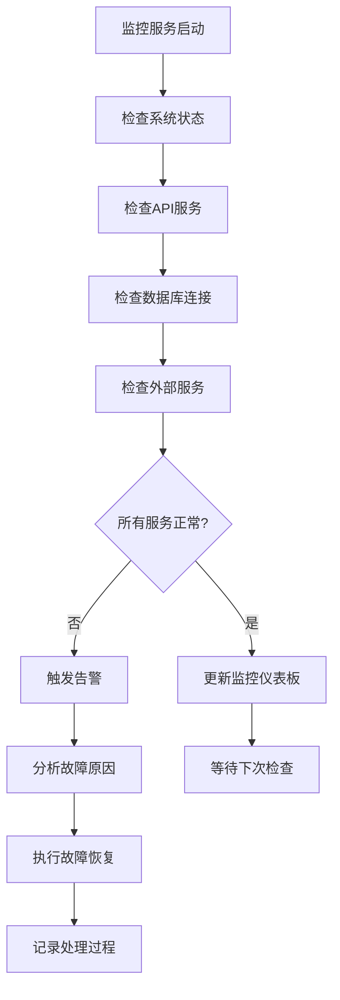

### 6.2 性能优化流程

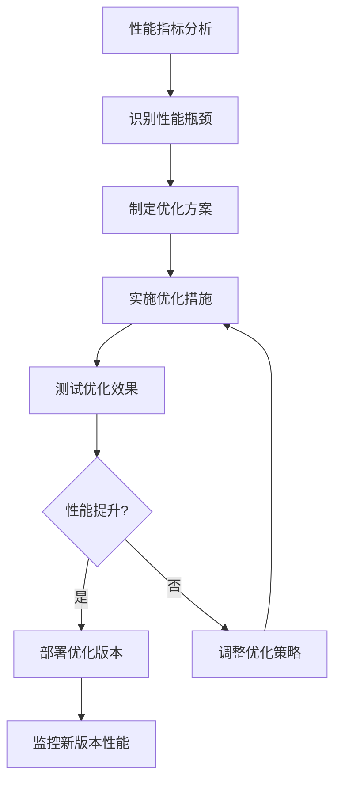

### 6.3 安全管理流程

```mermaid
flowchart TD
    A[安全扫描启动] --> B[扫描系统漏洞]
    B --> C[检查访问日志]
    C --> D[分析异常行为]
    D --> E{发现安全威胁?}
    E -->|否| F[生成安全报告]
    E -->|是| G[启动应急响应]
    G --> H[隔离受影响系统]
    H --> I[修复安全漏洞]
    I --> J[恢复系统服务]
    J --> K[加强安全防护]
```

这些详细的工作流程为 MRC 系统的各项业务操作提供了标准化的操作指南，确保系统的稳定运行和高质量的服务交付。