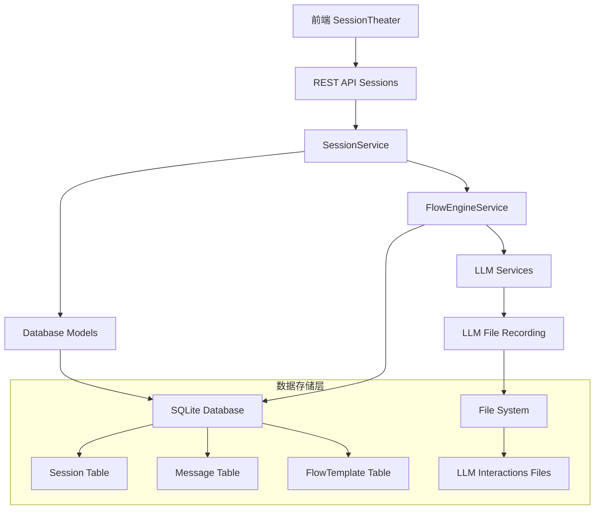

# 会话执行数据流分析文档

## 概述

本文档深入分析MRC系统中会话面板从开始到结束的完整执行逻辑，包括模板关系、数据流转过程以及关键的日志记录。通过系统性的数据流分析，帮助开发者理解系统的核心工作机制。

## 系统架构概览

### 核心组件关系图



## 1. 会话创建阶段数据流

### 1.1 前端触发会话创建

**触发时机**: 用户在MultiRoleDialogSystem组件中选择流程模板和角色配置

**前端数据流**:
```typescript
// 1. 用户输入数据
const sessionData = {
  topic: "选择一款泛血管介入产品...",
  flow_template_id: 1,
  role_mappings: {
    "角色A": 1,  // role_ref: role_id
    "角色B": 2
  }
}

// 2. API调用
const response = await sessionApi.createSession(sessionData)
```

**API请求详情**:
```bash
POST /api/sessions
Content-Type: application/json

{
  "topic": "选择一款泛血管介入产品，完成新项目立项阶段相关工作及文件输出...",
  "flow_template_id": 1,
  "role_mappings": {
    "产品专员": 1,
    "评审专家": 2
  }
}
```

### 1.2 后端会话创建流程

**SessionService.create_session() 数据处理**:

```python
# 1. 验证流程模板
flow_template = FlowTemplate.query.get(session_data['flow_template_id'])

# 2. 创建会话记录
session = Session(
    user_id=session_data.get('user_id'),
    topic=session_data['topic'],
    flow_template_id=session_data['flow_template_id'],
    status='not_started',
    current_round=0,
    executed_steps_count=0
)

# 3. 保存流程模板快照
session.flow_snapshot_dict = flow_template.to_dict(include_steps=True)

# 4. 创建会话角色映射
if role_mappings is not None:
    SessionService._create_session_roles(session.id, role_mappings)
    session.roles_snapshot_dict = SessionService._create_roles_snapshot(role_mappings)
```

**数据库插入记录**:
```sql
-- Session表插入
INSERT INTO sessions (user_id, topic, flow_template_id, status, current_round, executed_steps_count, created_at)
VALUES (NULL, '选择一款泛血管介入产品...', 1, 'not_started', 0, 0, '2025-12-07T21:30:25');

-- SessionRole表插入
INSERT INTO session_roles (session_id, role_ref, role_id, created_at)
VALUES (5, '产品专员', 1, '2025-12-07T21:30:25');
INSERT INTO session_roles (session_id, role_ref, role_id, created_at)
VALUES (5, '评审专家', 2, '2025-12-07T21:30:25');
```

### 1.3 会话创建关键日志

```
[2025-12-07 21:30:25,351] INFO: MultiRoleChat 后端服务启动 [in app/utils/monitoring.py:377]
[2025-12-07 21:30:26,280] INFO: 简化LLM管理器已初始化，模型: claude-3-sonnet-20240229
```

## 2. 会话执行阶段数据流

### 2.1 触发下一步执行

**用户操作**: 在SessionTheater组件中点击"下一步"按钮或自动执行

**前端事件处理**:
```typescript
const handleNextStep = async () => {
  setGenerating(true);

  // API调用执行下一步
  const result = await sessionApi.executeNextStep(session.id);

  // 更新消息列表
  if (result.message) {
    setMessages(prev => [...prev, result.message]);
  }

  // 更新LLM调试信息
  if (result.llm_debug && updateLLMDebugInfo) {
    updateLLMDebugInfo(result.llm_debug);
  }

  // 检查会话完成状态
  if (result.execution_info?.is_finished) {
    // 更新会话状态
  }

  setGenerating(false);
};
```

### 2.2 API执行端点处理

**API路由**: `POST /api/sessions/{id}/run-next-step`

**SessionExecution.execute() 数据处理**:
```python
class SessionExecution(Resource):
    def post(self, session_id):
        try:
            # 调用流程引擎执行下一步
            message, execution_info = FlowEngineService.execute_next_step(session_id)

            return {
                'success': True,
                'data': {
                    'message': message.to_dict(),
                    'execution_info': execution_info
                }
            }
        except Exception as e:
            return {
                'success': False,
                'error_code': 'EXECUTION_ERROR',
                'message': str(e)
            }
```

### 2.3 FlowEngineService 核心执行逻辑

**execute_next_step() 详细流程**:

```python
@staticmethod
def execute_next_step(session_id: int) -> Tuple[Message, Dict[str, Any]]:
    # 1. 获取会话状态
    session = Session.query.get(session_id)
    if session.status != 'running':
        raise FlowExecutionError(f"会话状态为 {session.status}，无法执行步骤")

    # 2. 获取当前步骤
    current_step = FlowStep.query.get(session.current_step_id)

    # 3. 获取发言角色
    role = SessionService.get_role_for_execution(session_id, current_step.speaker_role_ref)

    # 4. 获取或创建session_role
    speaker_session_role = SessionService.get_session_role_by_ref(
        session_id, current_step.speaker_role_ref
    )

    # 5. 构建上下文
    context = FlowEngineService._build_context(session, current_step)

    # 6. 调用LLM生成内容
    prompt_content, llm_response = FlowEngineService._generate_llm_response_sync(
        role, current_step, context, session=session
    )

    # 7. 创建消息记录
    message = Message(
        session_id=session_id,
        speaker_session_role_id=speaker_session_role.id,
        content=llm_response,
        content_summary=FlowEngineService._generate_content_summary(llm_response),
        round_index=session.current_round,
        section=FlowEngineService._determine_message_section(current_step)
    )

    # 8. 更新会话状态
    FlowEngineService._update_session_after_step_execution(session, current_step)

    # 9. 记录LLM交互（补充message_id）
    # ... LLM文件录制逻辑

    return message, execution_info
```

### 2.4 LLM调用和响应生成

**_generate_llm_response_sync() 详细流程**:

```python
@staticmethod
def _generate_llm_response_sync(role, current_step, context, session=None):
    # 1. 构建完整提示词
    prompt = FlowEngineService._build_prompt(role, current_step, context, session)

    # 2. LLM调用前录制
    FlowEngineService._last_llm_interaction_data = {
        'role_name': role.name,
        'step_id': current_step.id,
        'prompt': prompt,
        'response': '',  # 调用前为空
        'success': False,
        'metadata': {'stage': 'started'}
    }

    record_llm_interaction(
        session_id=session.id,
        role_name=role.name,
        prompt=prompt,
        response="",
        success=False,
        metadata={'stage': 'started'}
    )

    # 3. 调用LLM API
    try:
        llm_response = conversation_llm_service.generate_response(
            prompt, context.get('history_messages', [])
        )

        # 4. LLM调用后录制
        interaction_data = {
            'role_name': role.name,
            'step_id': current_step.id,
            'prompt': prompt,
            'response': llm_response.content,
            'success': True,
            'performance_metrics': llm_response.metrics,
            'provider': llm_response.provider
        }

        record_llm_interaction(
            session_id=session.id,
            prompt=prompt,
            response=llm_response.content,
            success=True,
            performance_metrics=llm_response.metrics
        )

        return prompt, llm_response.content

    except Exception as e:
        # 错误处理
        record_llm_interaction(
            session_id=session.id,
            prompt=prompt,
            response="",
            success=False,
            error_message=str(e)
        )
        raise
```

### 2.5 消息保存和数据库更新

**消息创建和保存**:
```python
# 创建消息对象
message = Message(
    session_id=session_id,
    speaker_session_role_id=speaker_session_role.id,
    content=llm_response,  # LLM生成的完整内容
    content_summary=FlowEngineService._generate_content_summary(llm_response),  # 自动生成摘要
    round_index=session.current_round,
    section=FlowEngineService._determine_message_section(current_step),
    created_at=datetime.utcnow()
)

# 数据库事务保存
db.session.add(message)
db.session.commit()
```

**会话状态更新**:
```python
def _update_session_after_step_execution(session, current_step):
    # 1. 增加执行步数
    session.executed_steps_count += 1

    # 2. 检查是否到达最后一步
    next_step_id = FlowEngineService._determine_next_step(session, current_step)

    if next_step_id is None:
        # 3. 会话完成
        session.status = 'finished'
        session.ended_at = datetime.utcnow()
    else:
        # 4. 更新下一步骤
        session.current_step_id = next_step_id

    session.updated_at = datetime.utcnow()
```

## 3. LLM文件录制数据流

### 3.1 录制时机和阶段

LLM交互录制分为三个关键阶段：

**阶段1: LLM调用开始**
```python
# 记录调用开始状态
record_llm_interaction(
    session_id=session.id,
    role_name=role.name,
    step_id=current_step.id,
    prompt=prompt,
    response="",  # 调用前为空
    success=False,
    metadata={'stage': 'started'}
)
```

**阶段2: LLM调用完成**
```python
# 记录完整响应
record_llm_interaction(
    session_id=session.id,
    role_name=role.name,
    step_id=current_step.id,
    prompt=prompt,
    response=llm_response.content,
    success=True,
    performance_metrics=llm_response.metrics,
    metadata={'stage': 'completed'}
)
```

**阶段3: 消息ID补充**
```python
# 补充message_id关联
record_llm_interaction(
    session_id=session.id,
    message_id=message.id,  # 关键关联信息
    role_name=role.name,
    step_id=current_step.id,
    prompt=prompt,
    response=llm_response,
    success=True,
    metadata={'stage': 'finalized', 'finalized': True}
)
```

### 3.2 录制数据存储

**文件组织结构**:
```
logs/llm_interactions/
├── by_session/
│   └── session_5/
│       └── 2025-12-07.json
├── by_date/
│   └── 2025-12-07_all_interactions.json
├── errors/
│   └── 2025-12-07_errors.json
└── real_time/
    └── latest.json
```

**录制数据示例**:
```json
{
    "id": "3ef2255b-32a5-45ff-80bd-e91f5acc71d7",
    "timestamp": "2025-12-07T12:28:14.716653",
    "session_id": 5,
    "message_id": null,
    "role_name": "产品专员",
    "step_id": 1,
    "round_index": 1,
    "provider": "claude-3-5-sonnet-20241022",
    "model": null,
    "prompt": "你是一个产品专员，针对下面的议题和修改意见写出产品文档...",
    "response": "# 项目立项文档：神经血管药物洗脱支架（DES）升级迭代项目...",
    "success": true,
    "error_message": null,
    "performance_metrics": {
        "response_time_ms": 28909,
        "history_messages_count": 0,
        "prompt_length": 451,
        "response_length": 2387
    },
    "metadata": {
        "stage": "completed",
        "task_type": "ask_question",
        "session_topic": "选择一款泛血管介入产品...",
        "model_used": "claude-3-5-sonnet-20241022",
        "message_id_pending": true
    }
}
```

### 3.3 最终补充录制

**消息ID补充逻辑**:
```python
# 在消息保存后补充message_id
if hasattr(FlowEngineService, '_last_llm_interaction_data'):
    interaction_data = FlowEngineService._last_llm_interaction_data
    record_llm_interaction(
        session_id=session.id,
        message_id=message.id,  # 关键关联信息
        role_name=interaction_data.get('role_name'),
        prompt=interaction_data.get('prompt'),
        response=interaction_data.get('response'),
        metadata={
            **interaction_data.get('metadata', {}),
            'message_id': message.id,
            'finalized': True  # 标记最终状态
        }
    )

    # 清理临时数据
    delattr(FlowEngineService, '_last_llm_interaction_data')
```

## 4. 数据库状态变化

### 4.1 会话状态流转

```
not_started → running → finished
     ↓            ↓            ↓
  创建时      执行中        完成时
```

### 4.2 核心表数据结构变化

**Session表状态变化**:
```sql
-- 创建时
INSERT INTO sessions (topic, flow_template_id, status, current_step_id, current_round, executed_steps_count)
VALUES ('会话主题', 1, 'not_started', 1, 0, 0);

-- 执行第一步后
UPDATE sessions SET
  status = 'running',
  current_step_id = 2,
  current_round = 1,
  executed_steps_count = 1,
  updated_at = '2025-12-07T12:28:14'
WHERE id = 5;

-- 完成时
UPDATE sessions SET
  status = 'finished',
  executed_steps_count = 3,
  ended_at = '2025-12-07T12:30:45'
WHERE id = 5;
```

**Message表数据累积**:
```sql
-- 每执行一步插入一条消息
INSERT INTO messages (
    session_id, speaker_session_role_id, content, content_summary,
    round_index, section, created_at
) VALUES (5, 8, 'LLM生成的完整内容', '内容摘要...', 1, '提问阶段', '2025-12-07T12:28:14');

INSERT INTO messages (
    session_id, speaker_session_role_id, content, content_summary,
    round_index, section, created_at
) VALUES (5, 9, '第二条消息内容', '第二条摘要...', 1, '回答阶段', '2025-12-07T12:29:20');

INSERT INTO messages (
    session_id, speaker_session_role_id, content, content_summary,
    round_index, section, created_at
) VALUES (5, 10, '第三条消息内容', '第三条摘要...', 1, '评审阶段', '2025-12-07T12:30:45');
```

## 5. 前后端数据同步

### 5.1 前端状态更新机制

**实时数据同步**:
```typescript
// 1. 执行步骤后更新会话状态
const result = await sessionApi.executeNextStep(session.id);

// 2. 更新消息列表
if (result.message) {
  setMessages(prev => [...prev, result.message]);
}

// 3. 更新会话信息
if (result.execution_info) {
  setSession(prev => ({
    ...prev,
    status: result.execution_info.session_status,
    current_round: result.execution_info.current_round,
    executed_steps_count: result.execution_info.executed_steps_count,
    current_step_id: result.execution_info.next_step_id,
    is_finished: result.execution_info.is_finished
  }));
}

// 4. 更新LLM调试信息
if (result.llm_debug && updateLLMDebugInfo) {
  updateLLMDebugInfo(result.llm_debug);
}
```

### 5.2 自动执行机制

**自动执行流程**:
```typescript
// 自动执行定时器
const autoExecutionTimerRef = useRef<ReturnType<typeof setTimeout> | null>(null);

// 自动执行间隔
const executionInterval = 3000; // 3秒

// 自动执行逻辑
useEffect(() => {
  if (autoMode && autoExecution && !generating && session?.status === 'running') {
    autoExecutionTimerRef.current = setTimeout(() => {
      handleNextStep();
    }, executionInterval);
  }

  return () => {
    if (autoExecutionTimerRef.current) {
      clearTimeout(autoExecutionTimerRef.current);
    }
  };
}, [autoMode, autoExecution, generating, session?.status]);
```

## 6. 错误处理和恢复机制

### 6.1 LLM调用错误处理

**错误类型和处理**:
```python
try:
    llm_response = conversation_llm_service.generate_response(prompt, context)

except LLMError as e:
    # 记录错误到文件系统
    record_llm_interaction(
        session_id=session.id,
        prompt=prompt,
        response="",
        success=False,
        error_message=str(e)
    )

    # 更新会话状态为错误
    session.status = 'error'
    session.error_reason = str(e)
    db.session.commit()

    raise FlowExecutionError(f"LLM调用失败: {str(e)}")

except Exception as e:
    # 通用错误处理
    current_app.logger.error(f"执行步骤时发生未知错误: {str(e)}")
    raise FlowExecutionError(f"步骤执行失败: {str(e)}")
```

### 6.2 数据库事务恢复

**事务回滚机制**:
```python
try:
    # 业务逻辑处理
    message = Message(...)
    session.current_step_id = next_step_id

    db.session.add(message)
    db.session.commit()  # 提交事务

except Exception as e:
    db.session.rollback()  # 回滚事务
    raise SessionError(f"创建会话失败: {str(e)}")
```

### 6.3 前端错误处理

**用户友好的错误提示**:
```typescript
const handleError = (error: any) => {
  console.error('会话执行错误:', error);

  // 显示错误消息
  if (error.response?.data?.message) {
    alert(error.response.data.message);
  } else {
    alert('会话执行发生错误，请稍后重试');
  }

  // 重置生成状态
  setGenerating(false);
};
```

## 7. 性能监控和日志记录

### 7.1 LLM性能监控

**性能指标录制**:
```python
performance_metrics = {
    "response_time_ms": 28909,        # 响应时间(毫秒)
    "history_messages_count": 0,        # 历史消息数量
    "prompt_length": 451,               # 提示词长度
    "response_length": 2387,            # 响应内容长度
    "tokens_used": llm_response.usage.total_tokens  # 使用的token数量
}
```

### 7.2 系统性能监控

**监控系统初始化日志**:
```
[2025-12-07 21:30:25,296] INFO: 性能监控服务初始化完成
[2025-12-07 21:30:25,298] INFO: 性能监控已启动，监控间隔: 30秒
[2025-12-07 21:30:25,299] INFO: 监控中间件已初始化
[2025-12-07 21:30:25,299] INFO: 监控告警配置已创建
```

### 7.3 API请求日志

**API调用追踪**:
```
[2025-12-07 12:28:14] INFO: [LLM-REQ-ID: LLM-1765101675310-de8ff2c9] API_LAYER - 接收LLM对话请求
[2025-12-07 12:28:14] INFO: [LLM-REQ-ID: LLM-1765101675310-de8ff2c9] API_LAYER - 用户提示信息处理完成
[2025-12-07 12:28:14] INFO: [LLM-REQ-ID: LLM-1765101675310-de8ff2c9] MANAGER_LAYER - 开始生成LLM响应
[2025-12-07 12:28:24] INFO: [LLM-REQ-ID: LLM-1765101675310-de8ff2c9] CORE_LAYER - Claude LLM响应生成成功
```

## 8. 数据完整性和一致性

### 8.1 数据一致性保证

**数据库事务原子性**:
- 消息创建和会话状态更新在同一事务中
- 失败时自动回滚，保持数据一致性
- 使用外键约束确保引用完整性

### 8.2 LLM录制数据完整性

**三阶段录制确保完整性**:
1. **调用前录制**: 记录请求参数和状态
2. **调用后录制**: 记录响应内容和性能数据
3. **消息ID补充**: 建立消息和LLM交互的关联关系

### 8.3 前后端数据同步

**状态同步机制**:
- 前端通过API轮询获取最新状态
- 实时更新UI组件状态
- 使用WebSocket通知（未来扩展）

## 9. 数据导出和分析

### 9.1 导出功能数据流

**导出API调用**:
```bash
GET /api/sessions/5/export?format=json
```

**导出数据处理**:
```python
def _export_to_json(session, messages):
    # 1. 获取LLM交互录制
    from app.services.llm_file_record_service import get_session_llm_interactions
    llm_interactions = get_session_llm_interactions(session.id)

    # 2. 构建消息LLM关联映射
    message_llm_map = {}
    for interaction in llm_interactions:
        msg_id = interaction.get('message_id')
        if msg_id is not None:
            message_llm_map[int(msg_id)] = interaction

    # 3. 构建导出数据
    export_data = {
        "session": session.to_dict(),
        "messages": [],
        "llm_interactions_summary": {
            "total_interactions": len(llm_interactions),
            "with_message_id": len([i for i in llm_interactions if i.get('message_id')]),
            "successful_interactions": len([i for i in llm_interactions if i.get('success', True)])
        }
    }
```

### 9.2 数据分析能力

**会话执行统计**:
- 总执行步数和轮次
- 各角色参与程度
- LLM调用成功率
- 平均响应时间
- 错误发生频率

**LLM使用分析**:
- 提示词长度分布
- 响应内容质量
- Token使用统计
- 性能瓶颈识别

## 10. 总结

### 10.1 核心数据流特征

1. **单向数据流**: 前端触发 → 后端处理 → 数据库存储 → 文件录制
2. **状态驱动**: 会话状态控制整个执行流程
3. **事务保证**: 数据库操作具有原子性
4. **异步处理**: LLM调用和文件录制不阻塞主流程
5. **多维度存储**: 数据库 + 文件系统的混合存储策略

### 10.2 关键设计模式

1. **快照机制**: 会话创建时保存模板和角色快照，确保执行一致性
2. **上下文构建**: 基于历史消息和模板配置动态构建LLM上下文
3. **错误隔离**: LLM调用错误不影响会话状态管理
4. **数据关联**: 通过message_id建立数据库消息和文件录制的关联
5. **分层架构**: 清晰的服务层划分，便于维护和扩展

### 10.3 性能优化策略

1. **异步处理**: LLM调用采用异步模式，提高并发性能
2. **文件缓冲**: 批量写入减少磁盘I/O操作
3. **数据库优化**: 合理的索引策略和查询优化
4. **缓存机制**: 减少重复数据查询和计算
5. **文件轮转**: 防止单文件过大影响性能

这套数据流分析文档提供了MRC系统会话执行的完整视图，有助于开发者理解系统的核心工作机制，进行问题排查和性能优化。