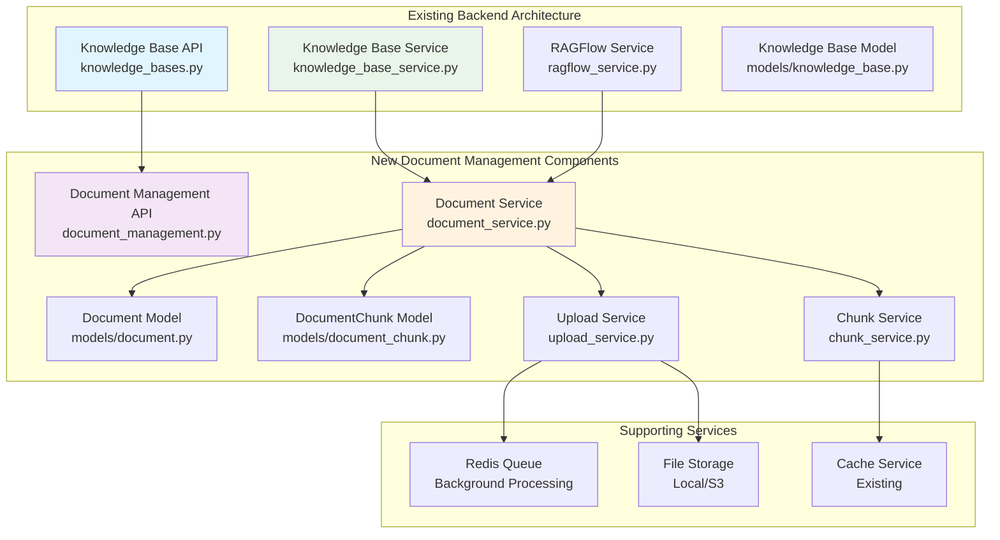
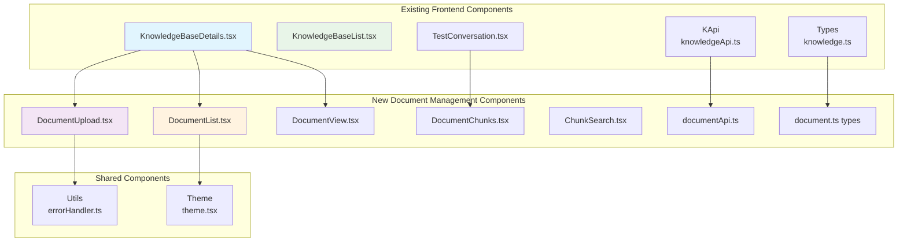

# Knowledge Base Document Management Feature Design Document

## Table of Contents

1. [Overview](#overview)
2. [Requirements Analysis](#requirements-analysis)
3. [Architecture Analysis](#architecture-analysis)
4. [Component Design](#component-design)
5. [API Design](#api-design)
6. [Data Models](#data-models)
7. [Frontend Components](#frontend-components)
8. [Technical Specifications](#technical-specifications)
9. [Implementation Plan](#implementation-plan)
10. [Risk Assessment](#risk-assessment)

## Overview

This document outlines the comprehensive design for extending the existing MRC Knowledge Base System with Document Management capabilities. The feature will allow users to upload, manage, search, and analyze individual documents within knowledge bases, providing granular control over knowledge base content and enhanced debugging capabilities for RAGFlow integration.

### Key Objectives

1. **Document Management**: Upload, organize, and manage individual documents within knowledge bases
2. **Content Analysis**: View document chunks, metadata, and processing status
3. **Enhanced Search**: Search within specific documents and across document chunks
4. **Integration**: Seamlessly integrate with existing Knowledge Base and RAGFlow systems
5. **User Experience**: Provide intuitive UI components that extend existing patterns

## Requirements Analysis

### Functional Requirements

#### FR-001: Document Upload Management
- Users can upload documents (PDF, DOCX, TXT, MD) to specific knowledge bases
- Support batch upload operations with progress tracking
- Document metadata extraction and validation
- File size and format validation

#### FR-002: Document Organization
- Categorize documents within knowledge bases
- Document tagging and metadata management
- Version control for document updates
- Document status tracking (uploading, processing, completed, error)

#### FR-003: Content Analysis
- View document processing status and chunks
- Display chunk-level content with metadata
- Show processing logs and error information
- Reference tracking for test conversations

#### FR-004: Search and Discovery
- Full-text search within documents
- Search across document chunks
- Filter by document type, status, and metadata
- Advanced search with similarity scoring

#### FR-005: Integration Features
- Integration with existing RAGFlow dataset management
- Enhanced test conversations with document references
- Role-document association management
- Statistics and usage analytics

### Non-Functional Requirements

#### NFR-001: Performance
- Document upload progress tracking
- Efficient chunk retrieval with pagination
- Caching for frequently accessed content
- Response time < 2 seconds for document list operations

#### NFR-002: Scalability
- Support knowledge bases with 1000+ documents
- Efficient handling of large files (>50MB)
- Concurrent upload processing
- Background processing for document parsing

#### NFR-003: Security
- File type validation and security scanning
- Access control based on knowledge base permissions
- Secure file storage and handling
- Audit logging for document operations

#### NFR-004: Usability
- Intuitive drag-and-drop upload interface
- Real-time progress indicators
- Comprehensive error messages and help
- Responsive design for mobile devices

## Architecture Analysis

### Existing System Integration

The Document Management feature extends the existing Knowledge Base System architecture:

#### Backend Architecture Integration



#### Frontend Architecture Integration



### Integration Patterns

#### 1. Service Layer Extension
The new document management follows the existing service layer patterns:
- **Singleton Service Pattern**: `get_document_service()` similar to `get_knowledge_base_service()`
- **Error Handling**: Consistent with existing RAGFlowAPIError patterns
- **Caching**: Integrates with existing cache service
- **Database Transactions**: Follows existing session management patterns

#### 2. API Endpoint Integration
- **RESTful Design**: Consistent with `/api/knowledge-bases` patterns
- **Response Format**: Uses existing `success/data/error_code` structure
- **Pagination**: Follows existing `page/page_size/total` patterns
- **Error Handling**: Consistent error codes and messages

#### 3. Frontend Component Patterns
- **Component Structure**: Follows existing prop patterns and TypeScript interfaces
- **State Management**: Uses existing useState/useEffect patterns
- **Styling**: Consistent with Tailwind CSS and theme system
- **API Integration**: Extends existing knowledgeApi patterns

## Component Design

### Backend Components

#### 1. Document Service (`document_service.py`)

```python
class DocumentService:
    """Document management service following existing patterns"""

    def __init__(self):
        self.cache_service = get_cache_service()
        self.ragflow_service = get_ragflow_service()
        self.upload_service = get_upload_service()
        self.chunk_service = get_chunk_service()

    # Document CRUD operations
    def create_document(self, knowledge_base_id: int, file_data, metadata: Dict) -> Document
    def get_documents_by_knowledge_base(self, knowledge_base_id: int, **filters) -> Tuple[List[Document], Dict]
    def get_document_by_id(self, document_id: int) -> Optional[Document]
    def update_document(self, document_id: int, **updates) -> Document
    def delete_document(self, document_id: int) -> bool

    # Document processing
    def process_document_upload(self, document_id: int) -> bool
    def sync_document_with_ragflow(self, document_id: int) -> Dict
    def get_document_chunks(self, document_id: int, **filters) -> Tuple[List[DocumentChunk], Dict]

    # Search and analytics
    def search_documents(self, knowledge_base_id: int, query: str, **filters) -> List[Document]
    def search_chunks(self, knowledge_base_id: int, query: str, **filters) -> List[DocumentChunk]
    def get_document_statistics(self, knowledge_base_id: int) -> Dict
```

#### 2. Upload Service (`upload_service.py`)

```python
class UploadService:
    """File upload handling service"""

    def validate_file(self, file_data) -> ValidationResult
    def save_file(self, file_data, knowledge_base_id: int) -> str  # returns file path
    def extract_metadata(self, file_path: str) -> Dict
    def queue_processing(self, document_id: int) -> str  # returns task ID
    def get_upload_progress(self, task_id: str) -> UploadProgress
```

#### 3. Chunk Service (`chunk_service.py`)

```python
class ChunkService:
    """Document chunk management service"""

    def get_chunks_by_document(self, document_id: int, **pagination) -> Tuple[List[DocumentChunk], Dict]
    def search_chunks(self, knowledge_base_id: int, query: str, **filters) -> List[DocumentChunk]
    def get_chunk_references(self, chunk_id: int) -> List[Reference]
    def analyze_chunk_content(self, chunk_id: int) -> ChunkAnalysis
```

### Frontend Components

#### 1. DocumentUpload Component

```typescript
interface DocumentUploadProps {
  knowledgeBaseId: number;
  onUploadComplete?: (documents: Document[]) => void;
  maxFileSize?: number; // bytes
  allowedTypes?: string[];
  multiple?: boolean;
}

const DocumentUpload: React.FC<DocumentUploadProps> = ({
  knowledgeBaseId,
  onUploadComplete,
  maxFileSize = 50 * 1024 * 1024, // 50MB
  allowedTypes = ['pdf', 'docx', 'txt', 'md'],
  multiple = true
}) => {
  // Drag and drop functionality
  // File validation
  // Progress tracking
  // Error handling
  // Integration with existing theme system
};
```

#### 2. DocumentList Component

```typescript
interface DocumentListProps {
  knowledgeBaseId: number;
  onDocumentSelect?: (document: Document) => void;
  showUploadButton?: boolean;
  filters?: DocumentListFilters;
}

interface DocumentListFilters {
  search?: string;
  status?: DocumentStatus[];
  type?: string[];
  dateRange?: {
    start: Date;
    end: Date;
  };
}
```

#### 3. DocumentView Component

```typescript
interface DocumentViewProps {
  documentId: number;
  knowledgeBaseId: number;
  viewMode?: 'metadata' | 'chunks' | 'preview';
  onChunkSelect?: (chunk: DocumentChunk) => void;
}
```

#### 4. DocumentChunks Component

```typescript
interface DocumentChunksProps {
  documentId: number;
  onChunkSearch?: (query: string) => void;
  showSearch?: boolean;
  pageSize?: number;
}
```

## API Design

### New API Endpoints

#### Document Management Endpoints

```python
# Document CRUD Operations
GET    /api/knowledge-bases/{knowledge_base_id}/documents
POST   /api/knowledge-bases/{knowledge_base_id}/documents
GET    /api/knowledge-bases/{knowledge_base_id}/documents/{document_id}
PUT    /api/knowledge-bases/{knowledge_base_id}/documents/{document_id}
DELETE /api/knowledge-bases/{knowledge_base_id}/documents/{document_id}

# Document Upload and Processing
POST   /api/knowledge-bases/{knowledge_base_id}/documents/upload
GET    /api/knowledge-bases/{knowledge_base_id}/documents/upload/{task_id}/progress
POST   /api/knowledge-bases/{knowledge_base_id}/documents/{document_id}/process
POST   /api/knowledge-bases/{knowledge_base_id}/documents/sync-with-ragflow

# Document Content Operations
GET    /api/knowledge-bases/{knowledge_base_id}/documents/{document_id}/chunks
GET    /api/knowledge-bases/{knowledge_base_id}/chunks/search
GET    /api/knowledge-bases/{knowledge_base_id}/documents/{document_id}/preview

# Document Analytics
GET    /api/knowledge-bases/{knowledge_base_id}/documents/statistics
GET    /api/knowledge-bases/{knowledge_base_id}/documents/{document_id}/analytics
```

### API Response Patterns

#### Document List Response

```python
# GET /api/knowledge-bases/{knowledge_base_id}/documents
{
  'success': True,
  'data': {
    'documents': [
      {
        'id': 1,
        'knowledge_base_id': 1,
        'filename': 'manual.pdf',
        'original_filename': 'User_Manual_v2.pdf',
        'file_size': 2048576,
        'file_type': 'pdf',
        'status': 'processed',
        'chunk_count': 45,
        'processing_progress': 100,
        'metadata': {
          'title': 'User Manual',
          'author': 'Documentation Team',
          'created_date': '2025-12-01',
          'page_count': 32
        },
        'created_at': '2025-12-08T10:30:00Z',
        'updated_at': '2025-12-08T10:45:00Z'
      }
    ],
    'total': 1,
    'page': 1,
    'page_size': 20,
    'pages': 1,
    'has_next': False,
    'has_prev': False
  }
}
```

#### Document Upload Response

```python
# POST /api/knowledge-bases/{knowledge_base_id}/documents/upload
{
  'success': True,
  'data': {
    'task_id': 'doc_upload_123456',
    'upload_id': 'upload_789',
    'status': 'processing',
    'progress': 0,
    'estimated_time': 120,
    'files': [
      {
        'filename': 'document.pdf',
        'size': 1024000,
        'status': 'uploading'
      }
    ]
  },
  'message': '文档上传已开始处理'
}
```

#### Document Search Response

```python
# GET /api/knowledge-bases/{knowledge_base_id}/chunks/search?query=installation
{
  'success': True,
  'data': {
    'chunks': [
      {
        'id': 123,
        'document_id': 1,
        'document_title': 'User Manual',
        'chunk_index': 5,
        'content': 'To begin the installation process...',
        'content_type': 'text',
        'similarity_score': 0.95,
        'metadata': {
          'page_number': 3,
          'section': 'Installation Guide'
        },
        'references_count': 2
      }
    ],
    'total': 15,
    'search_time': 0.045,
    'query': 'installation'
  }
}
```

## Data Models

### New Database Models

#### Document Model (`models/document.py`)

```python
class Document(db.Model):
    """文档模型"""
    __tablename__ = 'documents'

    id = db.Column(db.Integer, primary_key=True)
    knowledge_base_id = db.Column(db.Integer, db.ForeignKey('knowledge_bases.id'), nullable=False, index=True)

    # File information
    filename = db.Column(db.String(255), nullable=False)
    original_filename = db.Column(db.String(255), nullable=False)
    file_path = db.Column(db.String(500), nullable=False)
    file_size = db.Column(db.BigInteger, nullable=False)
    file_type = db.Column(db.String(50), nullable=False)  # pdf, docx, txt, md
    mime_type = db.Column(db.String(100), nullable=False)
    file_hash = db.Column(db.String(64), nullable=False, index=True)  # SHA-256

    # Processing information
    status = db.Column(db.String(50), nullable=False, default='uploading', index=True)  # uploading, processing, processed, error
    processing_progress = db.Column(db.Integer, default=0)  # 0-100
    chunk_count = db.Column(db.Integer, default=0)
    ragflow_document_id = db.Column(db.String(100), nullable=True)  # RAGFlow document ID
    processing_error = db.Column(db.Text, nullable=True)

    # Metadata (JSON)
    metadata_dict = db.Column(db.JSON, nullable=True)  # title, author, created_date, page_count, etc.

    # Timestamps
    created_at = db.Column(db.DateTime, default=datetime.utcnow, index=True)
    updated_at = db.Column(db.DateTime, default=datetime.utcnow, onupdate=datetime.utcnow)
    processed_at = db.Column(db.DateTime, nullable=True)

    # Relationships
    knowledge_base = db.relationship('KnowledgeBase', back_populates='documents')
    chunks = db.relationship('DocumentChunk', back_populates='document', lazy='dynamic', cascade='all, delete-orphan')

    # Indexes
    __table_args__ = (
        db.Index('idx_document_kb_status', 'knowledge_base_id', 'status'),
        db.Index('idx_document_file_hash', 'file_hash'),
        db.Index('idx_document_created_at', 'created_at'),
        db.UniqueConstraint('knowledge_base_id', 'filename', name='uq_document_kb_filename'),
    )

    def to_dict(self, include_chunks=False, include_metadata=True):
        """转换为字典"""
        result = {
            'id': self.id,
            'knowledge_base_id': self.knowledge_base_id,
            'filename': self.filename,
            'original_filename': self.original_filename,
            'file_size': self.file_size,
            'file_type': self.file_type,
            'status': self.status,
            'processing_progress': self.processing_progress,
            'chunk_count': self.chunk_count,
            'ragflow_document_id': self.ragflow_document_id,
            'created_at': self.created_at.isoformat() if self.created_at else None,
            'updated_at': self.updated_at.isoformat() if self.updated_at else None,
            'processed_at': self.processed_at.isoformat() if self.processed_at else None
        }

        if include_metadata:
            result['metadata'] = self.metadata_dict or {}

        if include_chunks:
            result['chunks'] = [chunk.to_dict() for chunk in self.chunks.limit(10)]

        return result
```

#### DocumentChunk Model (`models/document_chunk.py`)

```python
class DocumentChunk(db.Model):
    """文档块模型"""
    __tablename__ = 'document_chunks'

    id = db.Column(db.Integer, primary_key=True)
    document_id = db.Column(db.Integer, db.ForeignKey('documents.id'), nullable=False, index=True)
    knowledge_base_id = db.Column(db.Integer, db.ForeignKey('knowledge_bases.id'), nullable=False, index=True)

    # Chunk information
    chunk_index = db.Column(db.Integer, nullable=False)  # Order in document
    content = db.Column(db.Text, nullable=False)
    content_type = db.Column(db.String(50), default='text')  # text, image, table
    content_hash = db.Column(db.String(64), nullable=False, index=True)  # For deduplication

    # RAGFlow integration
    ragflow_chunk_id = db.Column(db.String(100), nullable=True)
    ragflow_vector_id = db.Column(db.String(100), nullable=True)

    # Metadata (JSON)
    metadata_dict = db.Column(db.JSON, nullable=True)  # page_number, section, position, etc.

    # Analytics
    reference_count = db.Column(db.Integer, default=0)  # Times referenced in conversations
    similarity_avg = db.Column(db.Float, default=0.0)  # Average similarity score
    last_referenced_at = db.Column(db.DateTime, nullable=True)

    # Timestamps
    created_at = db.Column(db.DateTime, default=datetime.utcnow, index=True)
    updated_at = db.Column(db.DateTime, default=datetime.utcnow, onupdate=datetime.utcnow)

    # Relationships
    document = db.relationship('Document', back_populates='chunks')
    knowledge_base = db.relationship('KnowledgeBase')
    references = db.relationship('ChunkReference', back_populates='chunk', cascade='all, delete-orphan')

    # Indexes
    __table_args__ = (
        db.Index('idx_chunk_document_index', 'document_id', 'chunk_index'),
        db.Index('idx_chunk_kb_content', 'knowledge_base_id', 'content_hash'),
        db.Index('idx_chunk_reference_count', 'reference_count'),
        db.UniqueConstraint('document_id', 'chunk_index', name='uq_chunk_document_index'),
    )

    def to_dict(self, include_metadata=True, include_references=False):
        """转换为字典"""
        result = {
            'id': self.id,
            'document_id': self.document_id,
            'knowledge_base_id': self.knowledge_base_id,
            'chunk_index': self.chunk_index,
            'content': self.content,
            'content_type': self.content_type,
            'ragflow_chunk_id': self.ragflow_chunk_id,
            'reference_count': self.reference_count,
            'similarity_avg': self.similarity_avg,
            'created_at': self.created_at.isoformat() if self.created_at else None,
            'updated_at': self.updated_at.isoformat() if self.updated_at else None,
            'last_referenced_at': self.last_referenced_at.isoformat() if self.last_referenced_at else None
        }

        if include_metadata:
            result['metadata'] = self.metadata_dict or {}

        if include_references:
            result['references'] = [ref.to_dict() for ref in self.references.limit(5)]

        return result
```

#### ChunkReference Model (`models/chunk_reference.py`)

```python
class ChunkReference(db.Model):
    """文档块引用模型 - 用于跟踪对话中的引用"""
    __tablename__ = 'chunk_references'

    id = db.Column(db.Integer, primary_key=True)
    chunk_id = db.Column(db.Integer, db.ForeignKey('document_chunks.id'), nullable=False, index=True)
    conversation_id = db.Column(db.Integer, db.ForeignKey('knowledge_base_conversations.id'), nullable=False, index=True)

    # Reference information
    similarity_score = db.Column(db.Float, nullable=False)  # 0-1
    snippet = db.Column(db.Text, nullable=False)  # Relevant snippet
    position = db.Column(db.Integer, nullable=False)  # Position in response

    # Metadata
    context_before = db.Column(db.Text, nullable=True)
    context_after = db.Column(db.Text, nullable=True)

    # Timestamps
    created_at = db.Column(db.DateTime, default=datetime.utcnow)

    # Relationships
    chunk = db.relationship('DocumentChunk', back_populates='references')
    conversation = db.relationship('KnowledgeBaseConversation', back_populates='chunk_references')

    # Indexes
    __table_args__ = (
        db.Index('idx_reference_conversation', 'conversation_id'),
        db.Index('idx_reference_similarity', 'similarity_score'),
    )
```

#### ProcessingLog Model (`models/processing_log.py`)

```python
class ProcessingLog(db.Model):
    """文档处理日志模型"""
    __tablename__ = 'processing_logs'

    id = db.Column(db.Integer, primary_key=True)
    document_id = db.Column(db.Integer, db.ForeignKey('documents.id'), nullable=False, index=True)

    # Log information
    step = db.Column(db.String(100), nullable=False)  # upload, extract, chunk, vectorize
    status = db.Column(db.String(50), nullable=False)  # started, completed, error
    message = db.Column(db.Text, nullable=False)
    details = db.Column(db.JSON, nullable=True)

    # Performance metrics
    duration_ms = db.Column(db.Integer, nullable=True)
    memory_usage = db.Column(db.BigInteger, nullable=True)

    # Timestamps
    created_at = db.Column(db.DateTime, default=datetime.utcnow, index=True)

    # Relationships
    document = db.relationship('Document')

    # Indexes
    __table_args__ = (
        db.Index('idx_processing_log_document_step', 'document_id', 'step'),
        db.Index('idx_processing_log_status', 'status'),
    )
```

### Model Relationships Update

Update existing KnowledgeBase model:

```python
# Add to existing KnowledgeBase model in models/knowledge_base.py
documents = db.relationship('Document', back_populates='knowledge_base', lazy='dynamic', cascade='all, delete-orphan')

# Add to existing KnowledgeBaseConversation model
chunk_references = db.relationship('ChunkReference', back_populates='conversation', cascade='all, delete-orphan')
```

## Frontend Components

### DocumentUpload Component

```typescript
// src/components/DocumentUpload.tsx
import React, { useState, useCallback } from 'react';
import { CloudUpload, FileText, X, CheckCircle, AlertCircle, Loader2 } from 'lucide-react';
import { useTheme } from '../theme';
import { documentApi } from '../api/documentApi';
import { Document, UploadProgress } from '../types/document';
import { handleError } from '../utils/errorHandler';

interface DocumentUploadProps {
  knowledgeBaseId: number;
  onUploadComplete?: (documents: Document[]) => void;
  maxFileSize?: number;
  allowedTypes?: string[];
  multiple?: boolean;
  className?: string;
}

const DocumentUpload: React.FC<DocumentUploadProps> = ({
  knowledgeBaseId,
  onUploadComplete,
  maxFileSize = 50 * 1024 * 1024,
  allowedTypes = ['pdf', 'docx', 'txt', 'md'],
  multiple = true,
  className = ''
}) => {
  const { theme } = useTheme();
  const [isDragging, setIsDragging] = useState(false);
  const [uploading, setUploading] = useState(false);
  const [files, setFiles] = useState<File[]>([]);
  const [uploadProgress, setUploadProgress] = useState<Record<string, UploadProgress>>({});

  const validateFile = (file: File): { valid: boolean; error?: string } => {
    if (file.size > maxFileSize) {
      return {
        valid: false,
        error: `文件大小超过限制 (${(maxFileSize / 1024 / 1024).toFixed(1)}MB)`
      };
    }

    const fileExtension = file.name.split('.').pop()?.toLowerCase();
    if (!fileExtension || !allowedTypes.includes(fileExtension)) {
      return {
        valid: false,
        error: `不支持的文件类型。支持的格式: ${allowedTypes.join(', ')}`
      };
    }

    return { valid: true };
  };

  const handleDragOver = useCallback((e: React.DragEvent) => {
    e.preventDefault();
    setIsDragging(true);
  }, []);

  const handleDragLeave = useCallback((e: React.DragEvent) => {
    e.preventDefault();
    setIsDragging(false);
  }, []);

  const handleDrop = useCallback((e: React.DragEvent) => {
    e.preventDefault();
    setIsDragging(false);

    const droppedFiles = Array.from(e.dataTransfer.files);
    addFiles(droppedFiles);
  }, []);

  const handleFileSelect = useCallback((e: React.ChangeEvent<HTMLInputElement>) => {
    if (e.target.files) {
      const selectedFiles = Array.from(e.target.files);
      addFiles(selectedFiles);
    }
  }, []);

  const addFiles = (newFiles: File[]) => {
    const validFiles = newFiles.filter(file => {
      const validation = validateFile(file);
      if (!validation.valid) {
        console.error(`文件验证失败: ${file.name} - ${validation.error}`);
        return false;
      }
      return true;
    });

    if (multiple) {
      setFiles(prev => [...prev, ...validFiles]);
    } else {
      setFiles(validFiles.slice(0, 1));
    }
  };

  const removeFile = (index: number) => {
    setFiles(prev => prev.filter((_, i) => i !== index));
  };

  const uploadFiles = async () => {
    if (files.length === 0) return;

    setUploading(true);

    try {
      const uploadPromises = files.map(async (file, index) => {
        const progressKey = `${file.name}-${index}`;

        try {
          // Start upload
          const uploadResponse = await documentApi.uploadDocument(
            knowledgeBaseId,
            file,
            (progress) => {
              setUploadProgress(prev => ({
                ...prev,
                [progressKey]: progress
              }));
            }
          );

          return uploadResponse.document;
        } catch (error) {
          console.error(`上传文件失败: ${file.name}`, error);
          throw error;
        }
      });

      const uploadedDocuments = await Promise.all(uploadPromises);

      if (onUploadComplete) {
        onUploadComplete(uploadedDocuments);
      }

      // Clear state
      setFiles([]);
      setUploadProgress({});

    } catch (error) {
      handleError(error);
    } finally {
      setUploading(false);
    }
  };

  const formatFileSize = (bytes: number): string => {
    if (bytes === 0) return '0 B';
    const k = 1024;
    const sizes = ['B', 'KB', 'MB', 'GB'];
    const i = Math.floor(Math.log(bytes) / Math.log(k));
    return parseFloat((bytes / Math.pow(k, i)).toFixed(2)) + ' ' + sizes[i];
  };

  return (
    <div className={`bg-white rounded-lg shadow-sm border border-gray-200 ${className}`}>
      <div className="p-6">
        <div className="flex items-center mb-4">
          <CloudUpload className="w-5 h-5 mr-2 text-blue-500" />
          <h3 className="text-lg font-semibold text-gray-900">上传文档</h3>
        </div>

        {/* Drag & Drop Area */}
        <div
          onDragOver={handleDragOver}
          onDragLeave={handleDragLeave}
          onDrop={handleDrop}
          className={`border-2 border-dashed rounded-lg p-8 text-center transition-colors ${
            isDragging
              ? 'border-blue-400 bg-blue-50'
              : 'border-gray-300 hover:border-gray-400'
          }`}
        >
          <CloudUpload className="w-12 h-12 mx-auto mb-4 text-gray-400" />

          <div className="mb-4">
            <p className="text-lg font-medium text-gray-900 mb-2">
              拖拽文件到此处上传
            </p>
            <p className="text-sm text-gray-500">
              或者点击下方按钮选择文件
            </p>
          </div>

          <input
            type="file"
            ref={fileInput}
            onChange={handleFileSelect}
            multiple={multiple}
            accept={allowedTypes.map(type => `.${type}`).join(',')}
            className="hidden"
          />

          <button
            onClick={() => fileInput.current?.click()}
            disabled={uploading}
            className={`px-4 py-2 text-sm font-medium text-white rounded-md ${theme.primary} ${theme.primaryHover} disabled:opacity-50 disabled:cursor-not-allowed transition-colors`}
          >
            选择文件
          </button>

          <div className="mt-4 text-xs text-gray-500">
            <p>支持的格式: {allowedTypes.join(', ').toUpperCase()}</p>
            <p>最大文件大小: {(maxFileSize / 1024 / 1024).toFixed(1)}MB</p>
          </div>
        </div>

        {/* File List */}
        {files.length > 0 && (
          <div className="mt-6">
            <h4 className="text-sm font-medium text-gray-900 mb-3">待上传文件</h4>
            <div className="space-y-2">
              {files.map((file, index) => {
                const progressKey = `${file.name}-${index}`;
                const progress = uploadProgress[progressKey];

                return (
                  <div
                    key={index}
                    className="flex items-center justify-between p-3 bg-gray-50 rounded-lg"
                  >
                    <div className="flex items-center flex-1 min-w-0">
                      <FileText className="w-5 h-5 mr-3 text-gray-400 flex-shrink-0" />
                      <div className="flex-1 min-w-0">
                        <p className="text-sm font-medium text-gray-900 truncate">
                          {file.name}
                        </p>
                        <p className="text-xs text-gray-500">
                          {formatFileSize(file.size)}
                        </p>
                      </div>
                    </div>

                    <div className="flex items-center space-x-2">
                      {progress && (
                        <div className="flex items-center mr-3">
                          {progress.status === 'completed' ? (
                            <CheckCircle className="w-4 h-4 text-green-500" />
                          ) : progress.status === 'error' ? (
                            <AlertCircle className="w-4 h-4 text-red-500" />
                          ) : (
                            <Loader2 className="w-4 h-4 text-blue-500 animate-spin" />
                          )}
                          <span className="ml-1 text-xs text-gray-600">
                            {progress.progress}%
                          </span>
                        </div>
                      )}

                      <button
                        onClick={() => removeFile(index)}
                        disabled={uploading}
                        className="p-1 text-gray-400 hover:text-gray-600 disabled:opacity-50 disabled:cursor-not-allowed"
                      >
                        <X className="w-4 h-4" />
                      </button>
                    </div>
                  </div>
                );
              })}
            </div>

            <div className="mt-4 flex justify-end">
              <button
                onClick={uploadFiles}
                disabled={uploading || files.length === 0}
                className={`px-6 py-2 text-sm font-medium text-white rounded-md ${theme.primary} ${theme.primaryHover} disabled:opacity-50 disabled:cursor-not-allowed transition-colors flex items-center`}
              >
                {uploading ? (
                  <>
                    <Loader2 className="w-4 h-4 mr-2 animate-spin" />
                    上传中...
                  </>
                ) : (
                  <>
                    <CloudUpload className="w-4 h-4 mr-2" />
                    开始上传
                  </>
                )}
              </button>
            </div>
          </div>
        )}
      </div>
    </div>
  );
};

export default DocumentUpload;
```

### DocumentList Component

```typescript
// src/components/DocumentList.tsx
import React, { useState, useEffect } from 'react';
import { Search, Filter, FileText, Calendar, MoreHorizontal, Eye, Trash2, Download } from 'lucide-react';
import { useTheme } from '../theme';
import { documentApi } from '../api/documentApi';
import { Document, DocumentListFilters } from '../types/document';
import { formatDate, formatFileSize } from '../utils/formatters';

interface DocumentListProps {
  knowledgeBaseId: number;
  onDocumentSelect?: (document: Document) => void;
  showUploadButton?: boolean;
  filters?: DocumentListFilters;
  onFiltersChange?: (filters: DocumentListFilters) => void;
}

const DocumentList: React.FC<DocumentListProps> = ({
  knowledgeBaseId,
  onDocumentSelect,
  showUploadButton = true,
  filters = {},
  onFiltersChange
}) => {
  const { theme } = useTheme();
  const [documents, setDocuments] = useState<Document[]>([]);
  const [loading, setLoading] = useState(true);
  const [pagination, setPagination] = useState({
    page: 1,
    pageSize: 20,
    total: 0,
    pages: 0
  });
  const [searchTerm, setSearchTerm] = useState(filters.search || '');
  const [showFilters, setShowFilters] = useState(false);

  const loadDocuments = async (page = 1) => {
    try {
      setLoading(true);

      const response = await documentApi.getDocuments(knowledgeBaseId, {
        page,
        page_size: pagination.pageSize,
        search: searchTerm,
        ...filters
      });

      setDocuments(response.data.documents);
      setPagination(prev => ({
        ...prev,
        page: response.data.page,
        total: response.data.total,
        pages: response.data.pages
      }));
    } catch (error) {
      console.error('Failed to load documents:', error);
    } finally {
      setLoading(false);
    }
  };

  useEffect(() => {
    if (knowledgeBaseId) {
      loadDocuments();
    }
  }, [knowledgeBaseId]);

  useEffect(() => {
    const timeoutId = setTimeout(() => {
      if (searchTerm !== filters.search) {
        onFiltersChange?.({ ...filters, search: searchTerm });
        loadDocuments(1);
      }
    }, 300);

    return () => clearTimeout(timeoutId);
  }, [searchTerm]);

  const getStatusBadge = (status: string) => {
    const statusConfig = {
      uploading: { color: 'bg-yellow-100 text-yellow-800', text: '上传中' },
      processing: { color: 'bg-blue-100 text-blue-800', text: '处理中' },
      processed: { color: 'bg-green-100 text-green-800', text: '已完成' },
      error: { color: 'bg-red-100 text-red-800', text: '错误' }
    };

    const config = statusConfig[status as keyof typeof statusConfig] || statusConfig.error;

    return (
      <span className={`inline-flex items-center px-2.5 py-0.5 rounded-full text-xs font-medium ${config.color}`}>
        {config.text}
      </span>
    );
  };

  const getFileTypeIcon = (fileType: string) => {
    // Return different icons based on file type
    return <FileText className="w-5 h-5 text-gray-400" />;
  };

  if (loading && documents.length === 0) {
    return (
      <div className="bg-white rounded-lg shadow-sm border border-gray-200 p-8">
        <div className="text-center">
          <div className="w-8 h-8 mx-auto animate-spin rounded-full border-2 border-gray-300 border-t-blue-600"></div>
          <p className="mt-4 text-gray-500">加载文档列表中...</p>
        </div>
      </div>
    );
  }

  return (
    <div className="bg-white rounded-lg shadow-sm border border-gray-200">
      {/* Header */}
      <div className="p-6 border-b border-gray-200">
        <div className="flex items-center justify-between">
          <div className="flex items-center flex-1 min-w-0">
            <h3 className="text-lg font-semibold text-gray-900">文档列表</h3>
            {pagination.total > 0 && (
              <span className="ml-3 text-sm text-gray-500">
                共 {pagination.total} 个文档
              </span>
            )}
          </div>

          <div className="flex items-center space-x-3">
            {/* Search */}
            <div className="relative">
              <Search className="absolute left-3 top-1/2 transform -translate-y-1/2 text-gray-400 w-4 h-4" />
              <input
                type="text"
                value={searchTerm}
                onChange={(e) => setSearchTerm(e.target.value)}
                placeholder="搜索文档..."
                className="pl-10 pr-4 py-2 border border-gray-300 rounded-md focus:outline-none focus:ring-2 focus:ring-blue-500 focus:border-transparent"
              />
            </div>

            {/* Filters */}
            <button
              onClick={() => setShowFilters(!showFilters)}
              className={`p-2 text-gray-600 hover:text-gray-900 hover:bg-gray-100 rounded-md transition-colors ${
                showFilters ? 'bg-gray-100' : ''
              }`}
            >
              <Filter className="w-4 h-4" />
            </button>
          </div>
        </div>

        {/* Filters Panel */}
        {showFilters && (
          <div className="mt-4 p-4 bg-gray-50 rounded-lg">
            <div className="grid grid-cols-1 md:grid-cols-3 gap-4">
              {/* Status Filter */}
              <div>
                <label className="block text-sm font-medium text-gray-700 mb-2">
                  状态
                </label>
                <select
                  value={filters.status?.[0] || ''}
                  onChange={(e) => onFiltersChange?.({
                    ...filters,
                    status: e.target.value ? [e.target.value] : undefined
                  })}
                  className="w-full px-3 py-2 border border-gray-300 rounded-md focus:outline-none focus:ring-2 focus:ring-blue-500"
                >
                  <option value="">全部状态</option>
                  <option value="uploading">上传中</option>
                  <option value="processing">处理中</option>
                  <option value="processed">已完成</option>
                  <option value="error">错误</option>
                </select>
              </div>

              {/* File Type Filter */}
              <div>
                <label className="block text-sm font-medium text-gray-700 mb-2">
                  文件类型
                </label>
                <select
                  value={filters.type?.[0] || ''}
                  onChange={(e) => onFiltersChange?.({
                    ...filters,
                    type: e.target.value ? [e.target.value] : undefined
                  })}
                  className="w-full px-3 py-2 border border-gray-300 rounded-md focus:outline-none focus:ring-2 focus:ring-blue-500"
                >
                  <option value="">全部类型</option>
                  <option value="pdf">PDF</option>
                  <option value="docx">DOCX</option>
                  <option value="txt">TXT</option>
                  <option value="md">MD</option>
                </select>
              </div>

              {/* Date Range Filter */}
              <div>
                <label className="block text-sm font-medium text-gray-700 mb-2">
                  上传时间
                </label>
                <input
                  type="date"
                  value={filters.dateRange?.start?.toISOString().split('T')[0] || ''}
                  onChange={(e) => onFiltersChange?.({
                    ...filters,
                    dateRange: {
                      start: new Date(e.target.value),
                      end: filters.dateRange?.end || new Date()
                    }
                  })}
                  className="w-full px-3 py-2 border border-gray-300 rounded-md focus:outline-none focus:ring-2 focus:ring-blue-500"
                />
              </div>
            </div>
          </div>
        )}
      </div>

      {/* Document List */}
      <div className="divide-y divide-gray-200">
        {documents.length === 0 ? (
          <div className="p-8 text-center">
            <FileText className="w-12 h-12 mx-auto text-gray-400 mb-4" />
            <p className="text-gray-500">
              {searchTerm || filters.status || filters.type ? '没有找到匹配的文档' : '还没有上传任何文档'}
            </p>
          </div>
        ) : (
          documents.map((document) => (
            <div
              key={document.id}
              className="p-6 hover:bg-gray-50 transition-colors"
            >
              <div className="flex items-center justify-between">
                <div className="flex items-center flex-1 min-w-0">
                  <div className="flex-shrink-0 mr-4">
                    {getFileTypeIcon(document.file_type)}
                  </div>

                  <div className="flex-1 min-w-0">
                    <div className="flex items-center space-x-3 mb-1">
                      <h4 className="text-sm font-medium text-gray-900 truncate">
                        {document.original_filename}
                      </h4>
                      {getStatusBadge(document.status)}
                    </div>

                    <div className="flex items-center space-x-4 text-xs text-gray-500">
                      <span>{formatFileSize(document.file_size)}</span>
                      <span>{document.chunk_count} 个文档块</span>
                      <div className="flex items-center">
                        <Calendar className="w-3 h-3 mr-1" />
                        {formatDate(document.created_at)}
                      </div>
                    </div>

                    {/* Processing Progress */}
                    {document.status === 'processing' && document.processing_progress !== undefined && (
                      <div className="mt-2">
                        <div className="w-full bg-gray-200 rounded-full h-1.5">
                          <div
                            className="bg-blue-600 h-1.5 rounded-full transition-all duration-300"
                            style={{ width: `${document.processing_progress}%` }}
                          ></div>
                        </div>
                        <p className="text-xs text-gray-500 mt-1">
                          处理进度: {document.processing_progress}%
                        </p>
                      </div>
                    )}

                    {/* Processing Error */}
                    {document.status === 'error' && document.processing_error && (
                      <div className="mt-2 p-2 bg-red-50 border border-red-200 rounded text-xs text-red-600">
                        {document.processing_error}
                      </div>
                    )}
                  </div>
                </div>

                {/* Actions */}
                <div className="flex items-center space-x-2 ml-4">
                  {document.status === 'processed' && (
                    <>
                      <button
                        onClick={() => onDocumentSelect?.(document)}
                        className={`p-2 text-gray-600 hover:text-gray-900 hover:bg-gray-100 rounded-md transition-colors`}
                        title="查看详情"
                      >
                        <Eye className="w-4 h-4" />
                      </button>

                      <button
                        className={`p-2 text-gray-600 hover:text-gray-900 hover:bg-gray-100 rounded-md transition-colors`}
                        title="下载文档"
                      >
                        <Download className="w-4 h-4" />
                      </button>
                    </>
                  )}

                  <button
                    className={`p-2 text-gray-600 hover:text-gray-900 hover:bg-gray-100 rounded-md transition-colors`}
                    title="更多操作"
                  >
                    <MoreHorizontal className="w-4 h-4" />
                  </button>
                </div>
              </div>
            </div>
          ))
        )}
      </div>

      {/* Pagination */}
      {pagination.pages > 1 && (
        <div className="p-6 border-t border-gray-200">
          <div className="flex items-center justify-between">
            <div className="text-sm text-gray-700">
              显示第 {((pagination.page - 1) * pagination.pageSize) + 1} 到{' '}
              {Math.min(pagination.page * pagination.pageSize, pagination.total)} 条，
              共 {pagination.total} 条记录
            </div>

            <div className="flex items-center space-x-2">
              <button
                onClick={() => loadDocuments(pagination.page - 1)}
                disabled={pagination.page <= 1}
                className="px-3 py-1 text-sm border border-gray-300 rounded-md hover:bg-gray-50 disabled:opacity-50 disabled:cursor-not-allowed"
              >
                上一页
              </button>

              <span className="px-3 py-1 text-sm text-gray-700">
                第 {pagination.page} 页，共 {pagination.pages} 页
              </span>

              <button
                onClick={() => loadDocuments(pagination.page + 1)}
                disabled={pagination.page >= pagination.pages}
                className="px-3 py-1 text-sm border border-gray-300 rounded-md hover:bg-gray-50 disabled:opacity-50 disabled:cursor-not-allowed"
              >
                下一页
              </button>
            </div>
          </div>
        </div>
      )}
    </div>
  );
};

export default DocumentList;
```

### TypeScript Interfaces

```typescript
// src/types/document.ts
export interface Document {
  id: number;
  knowledge_base_id: number;
  filename: string;
  original_filename: string;
  file_size: number;
  file_type: 'pdf' | 'docx' | 'txt' | 'md';
  mime_type: string;
  file_hash: string;
  status: 'uploading' | 'processing' | 'processed' | 'error';
  processing_progress?: number; // 0-100
  chunk_count: number;
  ragflow_document_id?: string;
  processing_error?: string;
  metadata: DocumentMetadata;
  created_at: string;
  updated_at?: string;
  processed_at?: string;
}

export interface DocumentMetadata {
  title?: string;
  author?: string;
  created_date?: string;
  page_count?: number;
  word_count?: number;
  language?: string;
  extracted_text_length?: number;
  custom_fields?: Record<string, any>;
}

export interface DocumentChunk {
  id: number;
  document_id: number;
  knowledge_base_id: number;
  chunk_index: number;
  content: string;
  content_type: 'text' | 'image' | 'table' | 'code';
  content_hash: string;
  ragflow_chunk_id?: string;
  ragflow_vector_id?: string;
  metadata: ChunkMetadata;
  reference_count: number;
  similarity_avg: number;
  last_referenced_at?: string;
  created_at: string;
  updated_at?: string;
}

export interface ChunkMetadata {
  page_number?: number;
  section?: string;
  position?: {
    start: number;
    end: number;
  };
  context_before?: string;
  context_after?: string;
  tokens_count?: number;
  keywords?: string[];
  entities?: Array<{
    type: string;
    value: string;
    confidence: number;
  }>;
}

export interface ChunkReference {
  id: number;
  chunk_id: number;
  conversation_id: number;
  similarity_score: number;
  snippet: string;
  position: number;
  context_before?: string;
  context_after?: string;
  created_at: string;
}

export interface ProcessingLog {
  id: number;
  document_id: number;
  step: string; // upload, extract, chunk, vectorize
  status: 'started' | 'completed' | 'error';
  message: string;
  details?: Record<string, any>;
  duration_ms?: number;
  memory_usage?: number;
  created_at: string;
}

export interface UploadProgress {
  task_id: string;
  status: 'uploading' | 'processing' | 'completed' | 'error';
  progress: number; // 0-100
  message?: string;
  error?: string;
  estimated_time?: number; // seconds
  current_step?: string;
  total_steps?: number;
}

export interface DocumentListFilters {
  search?: string;
  status?: Document['status'][];
  type?: Document['file_type'][];
  dateRange?: {
    start: Date;
    end: Date;
  };
  chunk_count_range?: {
    min: number;
    max: number;
  };
  has_error?: boolean;
}

export interface DocumentSearchParams {
  query: string;
  knowledge_base_id: number;
  document_ids?: number[];
  filters?: {
    content_types?: DocumentChunk['content_type'][];
    similarity_threshold?: number;
    include_metadata?: boolean;
  };
  pagination?: {
    page?: number;
    page_size?: number;
  };
  sort_by?: 'similarity' | 'created_at' | 'reference_count';
  sort_order?: 'asc' | 'desc';
}

export interface DocumentAnalytics {
  total_documents: number;
  total_chunks: number;
  total_size: number;
  average_chunks_per_document: number;
  status_distribution: Record<Document['status'], number>;
  type_distribution: Record<Document['file_type'], number>;
  processing_success_rate: number;
  average_processing_time: number;
  storage_usage: {
    used: number;
    available: number;
    percentage: number;
  };
  recent_activity: Array<{
    date: string;
    documents_uploaded: number;
    documents_processed: number;
    errors: number;
  }>;
}

// API Request/Response Types
export interface DocumentUploadRequest {
  knowledge_base_id: number;
  file: File;
  metadata?: Partial<DocumentMetadata>;
}

export interface DocumentUploadResponse {
  success: boolean;
  data: {
    task_id: string;
    upload_id: string;
    document: Document;
  };
  message?: string;
}

export interface DocumentListRequest {
  knowledge_base_id: number;
  page?: number;
  page_size?: number;
  search?: string;
  status?: Document['status'][];
  type?: Document['file_type'][];
  date_range?: {
    start: string;
    end: string;
  };
  sort_by?: 'created_at' | 'updated_at' | 'filename' | 'file_size' | 'chunk_count';
  sort_order?: 'asc' | 'desc';
}

export interface DocumentListResponse {
  success: boolean;
  data: {
    documents: Document[];
    total: number;
    page: number;
    page_size: number;
    pages: number;
    has_next: boolean;
    has_prev: boolean;
  };
}

export interface ChunkSearchRequest {
  knowledge_base_id: number;
  query: string;
  document_ids?: number[];
  filters?: {
    content_types?: DocumentChunk['content_type'][];
    similarity_threshold?: number;
    max_results?: number;
  };
  page?: number;
  page_size?: number;
}

export interface ChunkSearchResponse {
  success: boolean;
  data: {
    chunks: Array<DocumentChunk & {
      similarity_score: number;
      document_title: string;
      snippet: string;
    }>;
    total: number;
    search_time: number;
    query: string;
  };
}
```

## Technical Specifications

### Performance Optimization

#### 1. Database Optimization

```python
# Optimized queries with proper indexing
class DocumentService:
    def get_documents_with_chunks(self, knowledge_base_id: int, limit: int = 10):
        """Get documents with their chunks efficiently"""
        return (
            db.session.query(Document)
            .options(
                joinedload(Document.chunks).limit(5),  # Limit eager loaded chunks
                defer(Document.processing_error)  # Defer large fields
            )
            .filter_by(knowledge_base_id=knowledge_base_id)
            .order_by(Document.created_at.desc())
            .limit(limit)
            .all()
        )

    def search_chunks_optimized(self, knowledge_base_id: int, query: str):
        """Optimized chunk search with FTS"""
        # Use database-specific full-text search
        if db.session.bind.dialect.name == 'postgresql':
            return (
                db.session.query(DocumentChunk, Document)
                .join(Document)
                .filter(
                    Document.knowledge_base_id == knowledge_base_id,
                    DocumentChunk.content.op('@@')(func.to_tsquery(query))
                )
                .order_by(func.ts_rank(DocumentChunk.content, func.to_tsquery(query)).desc())
                .limit(50)
                .all()
            )
        else:
            # Fallback to LIKE for other databases
            return (
                db.session.query(DocumentChunk, Document)
                .join(Document)
                .filter(
                    Document.knowledge_base_id == knowledge_base_id,
                    DocumentChunk.content.contains(query)
                )
                .order_by(DocumentChunk.reference_count.desc())
                .limit(50)
                .all()
            )
```

#### 2. Caching Strategy

```python
# Multi-level caching for document management
class DocumentCacheService:
    def __init__(self):
        self.cache_service = get_cache_service()
        self.local_cache = {}  # In-memory cache for frequently accessed data

    def get_document_with_cache(self, document_id: int) -> Optional[Document]:
        """Get document with multi-level caching"""
        # Level 1: Local memory cache
        if document_id in self.local_cache:
            return self.local_cache[document_id]

        # Level 2: Redis cache
        cache_key = f"document:{document_id}"
        cached_data = self.cache_service.get(cache_key)
        if cached_data:
            document = Document.from_dict(cached_data)
            self.local_cache[document_id] = document  # Warm local cache
            return document

        # Level 3: Database
        document = Document.query.get(document_id)
        if document:
            self.cache_service.set(cache_key, document.to_dict(), ttl=3600)
            self.local_cache[document_id] = document

        return document

    def invalidate_document_cache(self, document_id: int):
        """Invalidate all cache entries for a document"""
        cache_key = f"document:{document_id}"
        self.cache_service.delete(cache_key)
        self.local_cache.pop(document_id, None)

        # Invalidate related caches
        self.cache_service.delete_pattern(f"document:{document_id}:chunks:*")
        self.cache_service.delete_pattern(f"kb:document:{document.knowledge_base_id}:*")
```

#### 3. Background Processing

```python
# Asynchronous document processing with Celery/RQ
from rq import Queue
from redis import Redis

class DocumentProcessingService:
    def __init__(self):
        self.redis_conn = Redis()
        self.queue = Queue('document_processing', connection=self.redis_conn)

    def queue_document_processing(self, document_id: int) -> str:
        """Queue document for background processing"""
        job = self.queue.enqueue(
            'app.tasks.process_document',
            document_id,
            timeout='30m',  # 30 minutes timeout
            retry=3,
            retry_interval=60
        )
        return job.id

    def get_processing_status(self, task_id: str) -> ProcessingStatus:
        """Get status of background processing task"""
        try:
            job = Job.fetch(task_id, connection=self.redis_conn)
            return ProcessingStatus(
                task_id=task_id,
                status=job.get_status(),
                progress=job.meta.get('progress', 0),
                message=job.meta.get('message'),
                result=job.result
            )
        except Exception as e:
            return ProcessingStatus(
                task_id=task_id,
                status='error',
                message=str(e)
            )
```

### Security Implementation

#### 1. File Security

```python
import magic
import hashlib
from werkzeug.utils import secure_filename

class FileSecurityService:
    ALLOWED_MIME_TYPES = {
        'application/pdf',
        'application/vnd.openxmlformats-officedocument.wordprocessingml.document',
        'text/plain',
        'text/markdown'
    }

    MAX_FILE_SIZE = 50 * 1024 * 1024  # 50MB

    def validate_file(self, file) -> ValidationResult:
        """Comprehensive file validation"""
        # Check file size
        if file.content_length > self.MAX_FILE_SIZE:
            return ValidationResult(False, "文件大小超过限制")

        # Check file extension
        filename = secure_filename(file.filename)
        if not self._is_allowed_extension(filename):
            return ValidationResult(False, "不支持的文件类型")

        # Check MIME type
        file_content = file.read(1024)  # Read first 1KB for MIME detection
        file.seek(0)  # Reset file pointer

        mime_type = magic.from_buffer(file_content, mime=True)
        if mime_type not in self.ALLOWED_MIME_TYPES:
            return ValidationResult(False, "文件类型验证失败")

        return ValidationResult(True)

    def calculate_file_hash(self, file_path: str) -> str:
        """Calculate SHA-256 hash of file"""
        sha256_hash = hashlib.sha256()
        with open(file_path, "rb") as f:
            for chunk in iter(lambda: f.read(4096), b""):
                sha256_hash.update(chunk)
        return sha256_hash.hexdigest()
```

#### 2. Access Control

```python
# Document access control based on knowledge base permissions
class DocumentAccessService:
    def check_document_access(self, user_id: int, document_id: int, action: str) -> bool:
        """Check if user has access to document"""
        document = Document.query.get(document_id)
        if not document:
            return False

        # Check knowledge base access
        knowledge_base = document.knowledge_base
        return self.check_knowledge_base_access(user_id, knowledge_base.id, action)

    def filter_accessible_documents(self, user_id: int, knowledge_base_id: int) -> List[Document]:
        """Filter documents user can access"""
        # Check knowledge base access first
        if not self.check_knowledge_base_access(user_id, knowledge_base_id, 'read'):
            return []

        # Return all documents in the knowledge base
        return Document.query.filter_by(knowledge_base_id=knowledge_base_id).all()
```

### Error Handling

#### 1. Comprehensive Error Types

```python
class DocumentManagementError(Exception):
    """Base exception for document management"""
    pass

class FileValidationError(DocumentManagementError):
    """File validation failed"""
    pass

class DocumentNotFoundError(DocumentManagementError):
    """Document not found"""
    pass

class ProcessingError(DocumentManagementError):
    """Document processing failed"""
    pass

class StorageError(DocumentManagementError):
    """File storage error"""
    pass
```

#### 2. API Error Response Format

```python
# Consistent error response format
def handle_document_error(error: Exception) -> Dict:
    """Convert exceptions to standardized API responses"""
    error_mapping = {
        FileValidationError: (400, 'FILE_VALIDATION_ERROR'),
        DocumentNotFoundError: (404, 'DOCUMENT_NOT_FOUND'),
        ProcessingError: (500, 'PROCESSING_ERROR'),
        StorageError: (500, 'STORAGE_ERROR'),
    }

    for error_type, (status_code, error_code) in error_mapping.items():
        if isinstance(error, error_type):
            return {
                'success': False,
                'error_code': error_code,
                'message': str(error),
                'details': getattr(error, 'details', None)
            }, status_code

    # Fallback for unexpected errors
    current_app.logger.error(f"Unexpected document management error: {error}")
    return {
        'success': False,
        'error_code': 'INTERNAL_ERROR',
        'message': '内部服务器错误'
    }, 500
```

### Integration with Existing Systems

#### 1. Knowledge Base Service Integration

```python
# Extend existing KnowledgeBaseService
class KnowledgeBaseService:
    def get_documents_summary(self, knowledge_base_id: int) -> Dict:
        """Get documents summary for knowledge base"""
        documents = Document.query.filter_by(knowledge_base_id=knowledge_base_id).all()

        return {
            'total_documents': len(documents),
            'total_size': sum(d.file_size for d in documents),
            'status_distribution': {
                status: len([d for d in documents if d.status == status])
                for status in ['uploading', 'processing', 'processed', 'error']
            },
            'file_type_distribution': {
                file_type: len([d for d in documents if d.file_type == file_type])
                for file_type in set(d.file_type for d in documents)
            },
            'total_chunks': sum(d.chunk_count for d in documents if d.status == 'processed')
        }

    def sync_documents_with_ragflow(self, knowledge_base_id: int) -> Dict:
        """Sync all documents in knowledge base with RAGFlow"""
        documents = Document.query.filter_by(
            knowledge_base_id=knowledge_base_id,
            status='processed'
        ).all()

        results = []
        for document in documents:
            try:
                document_service = get_document_service()
                result = document_service.sync_document_with_ragflow(document.id)
                results.append(result)
            except Exception as e:
                results.append({
                    'document_id': document.id,
                    'success': False,
                    'error': str(e)
                })

        return {
            'total_documents': len(documents),
            'success_count': len([r for r in results if r['success']]),
            'error_count': len([r for r in results if not r['success']]),
            'results': results
        }
```

#### 2. RAGFlow Service Extension

```python
# Extend existing RAGFlowService
class RAGFlowService:
    def upload_document_to_ragflow(self, dataset_id: str, file_path: str, metadata: Dict) -> str:
        """Upload document to RAGFlow dataset"""
        try:
            with open(file_path, 'rb') as f:
                files = {'file': f}
                data = {
                    'name': metadata.get('title', os.path.basename(file_path)),
                    'description': metadata.get('description', ''),
                    'parser_config': json.dumps({
                        'chunk_token_num': 512,
                        'layout_recognize': True,
                        'raptor': False
                    })
                }

                response = self._make_request(
                    'POST',
                    f'/api/datasets/{dataset_id}/documents',
                    files=files,
                    data=data
                )

                return response['data']['doc_id']
        except Exception as e:
            raise RAGFlowAPIError(f"Failed to upload document to RAGFlow: {str(e)}")

    def get_document_chunks_from_ragflow(self, dataset_id: str, document_id: str) -> List[Dict]:
        """Get document chunks from RAGFlow"""
        try:
            response = self._make_request(
                'GET',
                f'/api/datasets/{dataset_id}/documents/{document_id}/chunks'
            )
            return response['data']['chunks']
        except Exception as e:
            raise RAGFlowAPIError(f"Failed to get document chunks from RAGFlow: {str(e)}")
```

## Implementation Plan

### Phase 1: Core Infrastructure (Week 1-2)

#### Backend Development
- [ ] Create database models (`Document`, `DocumentChunk`, `ChunkReference`, `ProcessingLog`)
- [ ] Implement migration scripts for new tables
- [ ] Create base `DocumentService` with CRUD operations
- [ ] Implement `UploadService` with file validation and storage
- [ ] Set up background processing queue (Redis/RQ)
- [ ] Create base API endpoints in `document_management.py`

#### Frontend Development
- [ ] Create TypeScript interfaces for document types
- [ ] Implement base `documentApi.ts` with API client functions
- [ ] Create basic `DocumentUpload` component with drag-and-drop
- [ ] Implement `DocumentList` component with pagination and filtering
- [ ] Integrate new components into existing `KnowledgeBaseDetails`

### Phase 2: Document Processing (Week 3-4)

#### Backend Development
- [ ] Implement document processing pipeline with RAGFlow integration
- [ ] Create `ChunkService` for document chunk management
- [ ] Implement search functionality with full-text search
- [ ] Add document analytics and statistics
- [ ] Implement caching layer for performance

#### Frontend Development
- [ ] Create `DocumentView` component for document details
- [ ] Implement `DocumentChunks` component for chunk viewing
- [ ] Create `ChunkSearch` component with advanced search UI
- [ ] Add progress indicators and error handling
- [ ] Implement real-time updates for document processing

### Phase 3: Advanced Features (Week 5-6)

#### Backend Development
- [ ] Implement document versioning and history
- [ ] Add bulk operations (batch upload, delete, process)
- [ ] Create comprehensive analytics dashboard
- [ ] Implement advanced search with filters and sorting
- [ ] Add export functionality for documents and analytics

#### Frontend Development
- [ ] Create document management dashboard
- [ ] Implement advanced search UI with filters
- [ ] Add bulk operations interface
- [ ] Create analytics and reporting views
- [ ] Implement mobile responsive design

### Phase 4: Integration and Testing (Week 7-8)

#### Integration
- [ ] Integrate document management with existing role system
- [ ] Enhance test conversations with document references
- [ ] Add document associations to role-knowledge base relationships
- [ ] Implement unified search across documents and conversations

#### Testing and Quality Assurance
- [ ] Comprehensive unit tests for all services
- [ ] Integration tests for RAGFlow synchronization
- [ ] Performance testing with large document sets
- [ ] Security testing for file upload and access control
- [ ] User acceptance testing and feedback collection

#### Documentation
- [ ] API documentation updates
- [ ] User documentation for document management features
- [ ] Developer documentation for extending the system
- [ ] Deployment and configuration guides

## Risk Assessment

### Technical Risks

#### 1. RAGFlow Integration Complexity
**Risk**: RAGFlow API changes or limitations could impact document processing
**Mitigation**:
- Implement robust error handling and retry logic
- Create fallback mechanisms for manual document processing
- Maintain abstraction layer for RAGFlow integration

#### 2. File Storage Scalability
**Risk**: Large file storage could impact system performance and cost
**Mitigation**:
- Implement file compression and optimization
- Use cloud storage with lifecycle policies
- Monitor storage usage and implement quotas

#### 3. Performance at Scale
**Risk**: Large knowledge bases with thousands of documents could impact query performance
**Mitigation**:
- Implement comprehensive caching strategy
- Use database optimization techniques (indexing, query optimization)
- Implement pagination and lazy loading for large datasets

### Operational Risks

#### 1. File Security
**Risk**: Malicious file uploads could compromise system security
**Mitigation**:
- Implement comprehensive file validation and scanning
- Use sandboxed environments for file processing
- Regular security audits and updates

#### 2. Data Consistency
**Risk**: Synchronization issues between local database and RAGFlow
**Mitigation**:
- Implement robust consistency checks and reconciliation
- Use transaction management for data integrity
- Create audit logging for all synchronization operations

#### 3. User Experience
**Risk**: Complex document management could confuse users
**Mitigation**:
- Conduct user experience testing and feedback sessions
- Implement intuitive UI/UX with clear guidance
- Provide comprehensive documentation and help resources

### Business Risks

#### 1. Resource Requirements
**Risk**: Increased storage and processing requirements could impact costs
**Mitigation**:
- Implement resource monitoring and alerting
- Use efficient compression and storage strategies
- Plan for scalable infrastructure growth

#### 2. Maintenance Overhead
**Risk**: Additional features could increase maintenance complexity
**Mitigation**:
- Follow existing architectural patterns and conventions
- Implement comprehensive testing and monitoring
- Document all components and interfaces thoroughly

---

This comprehensive design document provides the foundation for implementing the Knowledge Base Document Management feature while maintaining consistency with the existing MRC system architecture and patterns. The modular approach ensures that each component can be developed, tested, and deployed incrementally, reducing risks and allowing for iterative improvements based on user feedback.