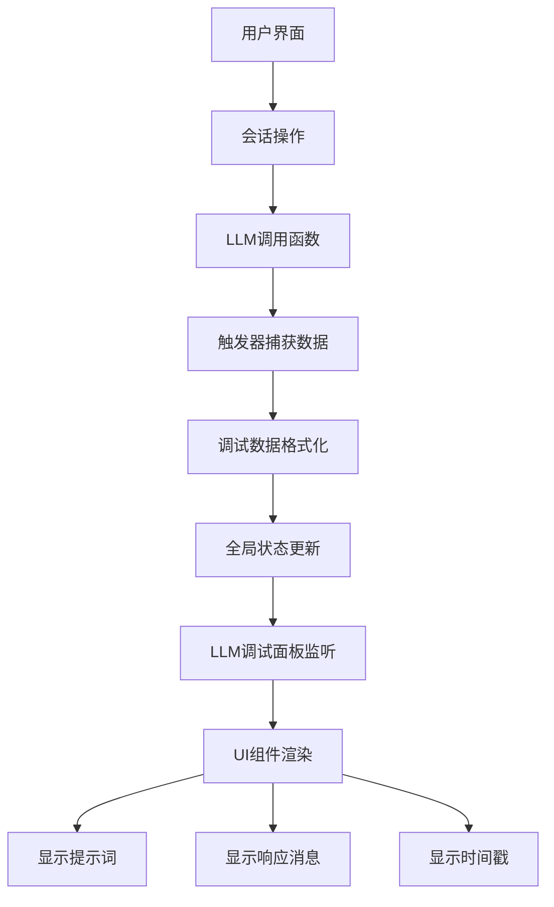

# 数据流设计文档

## 数据流概述

LLM调试面板的数据流主要涉及：LLM调用 → 数据捕获 → 状态管理 → UI渲染 四个核心环节。

## 核心数据流架构



## 详细数据流程

### 1. 数据源层 (Data Source Layer)

#### 1.1 LLM调用数据捕获点
```typescript
// 在后端或前端LLM调用函数中
interface LLMCallData {
  id: string;           // 唯一标识符
  timestamp: number;    // 调用时间戳
  prompt: string;       // 发送的提示词
  response: string;     // LLM返回的响应
  sessionId: string;    // 会话ID
  stepId?: string;      // 步骤ID（可选）
  model: string;        // 使用的模型
  duration?: number;    // 调用耗时（可选）
}
```

#### 1.2 触发器位置
```typescript
// 前端API调用层捕获
const originalCall = llmApi.generateResponse;
llmApi.generateResponse = async function(prompt, options) {
  const startTime = Date.now();
  const callData = {
    id: generateId(),
    timestamp: startTime,
    prompt: prompt,
    sessionId: currentSession.id
  };

  // 触发调试数据更新
  DebugPanelManager.addPendingCall(callData);

  try {
    const response = await originalCall.call(this, prompt, options);
    callData.response = response;
    callData.duration = Date.now() - startTime;
    DebugPanelManager.updateCall(callData);
    return response;
  } catch (error) {
    callData.response = `Error: ${error.message}`;
    callData.duration = Date.now() - startTime;
    DebugPanelManager.updateCall(callData);
    throw error;
  }
};
```

### 2. 状态管理层 (State Management Layer)

#### 2.1 调试数据状态结构
```typescript
interface DebugPanelState {
  calls: LLMCallData[];           // 所有调用记录
  activeCallId: string | null;    // 当前活跃的调用ID
  isVisible: boolean;             // 面板可见性
  autoScroll: boolean;            // 自动滚动
  maxRecords: number;             // 最大记录数
}

const initialState: DebugPanelState = {
  calls: [],
  activeCallId: null,
  isVisible: true,
  autoScroll: true,
  maxRecords: 50
};
```

#### 2.2 状态管理实现方案
```typescript
// 方案A: React Context + useReducer
const DebugPanelContext = createContext<{
  state: DebugPanelState;
  addCall: (call: LLMCallData) => void;
  updateCall: (call: LLMCallData) => void;
  clearCalls: () => void;
} | null>(null);

function debugPanelReducer(state: DebugPanelState, action: any): DebugPanelState {
  switch (action.type) {
    case 'ADD_CALL':
      return {
        ...state,
        calls: [...state.calls, action.payload].slice(-state.maxRecords)
      };
    case 'UPDATE_CALL':
      return {
        ...state,
        calls: state.calls.map(call =>
          call.id === action.payload.id ? action.payload : call
        )
      };
    case 'CLEAR_CALLS':
      return { ...state, calls: [] };
    default:
      return state;
  }
}

// 方案B: 简单全局状态（符合"简单实现"要求）
class DebugPanelManager {
  private static instance: DebugPanelManager;
  private listeners: Set<() => void> = new Set();
  private state: DebugPanelState = initialState;

  static getInstance(): DebugPanelManager {
    if (!DebugPanelManager.instance) {
      DebugPanelManager.instance = new DebugPanelManager();
    }
    return DebugPanelManager.instance;
  }

  addPendingCall(callData: Partial<LLMCallData>) {
    this.state.calls.push({
      ...callData,
      response: 'Loading...',
      duration: 0
    } as LLMCallData);
    this.notifyListeners();
  }

  updateCall(callData: LLMCallData) {
    const index = this.state.calls.findIndex(call => call.id === callData.id);
    if (index !== -1) {
      this.state.calls[index] = callData;
      this.notifyListeners();
    }
  }

  getState(): DebugPanelState {
    return { ...this.state };
  }

  subscribe(listener: () => void) {
    this.listeners.add(listener);
    return () => this.listeners.delete(listener);
  }

  private notifyListeners() {
    this.listeners.forEach(listener => listener());
  }
}
```

### 3. 组件通信层 (Component Communication Layer)

#### 3.1 数据订阅机制
```typescript
// 在LLM调试面板组件中
export function LLMDebugPanel() {
  const [state, setState] = useState<DebugPanelState>(initialState);

  useEffect(() => {
    const manager = DebugPanelManager.getInstance();

    const updateState = () => {
      setState(manager.getState());
    };

    const unsubscribe = manager.subscribe(updateState);
    updateState(); // 初始状态

    return unsubscribe;
  }, []);

  return (
    <div className="llm-debug-panel">
      <DebugHeader state={state} />
      <DebugContent calls={state.calls} />
    </div>
  );
}
```

#### 3.2 会话剧场集成
```typescript
// 在SessionTheater组件中集成调试面板
export function SessionTheater({ session, messages }: SessionTheaterProps) {
  return (
    <div className="session-theater-container">
      {/* 左侧主会话区域 */}
      <div className="session-main">
        <MessageList messages={messages} />
        <MessageInput onSendMessage={handleSendMessage} />
      </div>

      {/* 右侧调试面板 */}
      <div className="session-sidebar">
        <LLMDebugPanel />
      </div>
    </div>
  );
}
```

### 4. UI渲染层 (UI Rendering Layer)

#### 4.1 数据渲染流程
```typescript
function DebugContent({ calls }: { calls: LLMCallData[] }) {
  const endRef = useRef<HTMLDivElement>(null);

  // 自动滚动到底部
  useEffect(() => {
    if (endRef.current) {
      endRef.current.scrollIntoView({ behavior: 'smooth' });
    }
  }, [calls]);

  return (
    <div className="debug-content">
      {calls.map(call => (
        <DebugCallItem key={call.id} call={call} />
      ))}
      <div ref={endRef} />
    </div>
  );
}

function DebugCallItem({ call }: { call: LLMCallData }) {
  return (
    <div className="debug-call-item">
      <div className="debug-header">
        <span className="debug-time">
          {new Date(call.timestamp).toLocaleTimeString()}
        </span>
        <span className="debug-model">{call.model}</span>
        {call.duration && (
          <span className="debug-duration">{call.duration}ms</span>
        )}
      </div>

      <div className="debug-section">
        <h4>提示词:</h4>
        <pre className="debug-prompt">{call.prompt}</pre>
      </div>

      <div className="debug-section">
        <h4>响应:</h4>
        <pre className="debug-response">{call.response}</pre>
      </div>
    </div>
  );
}
```

## 数据流优化策略

### 1. 性能优化
```typescript
// 使用React.memo优化渲染
const DebugCallItem = React.memo(({ call }: { call: LLMCallData }) => {
  // 组件实现
});

// 虚拟滚动（大量数据时）
import { FixedSizeList as List } from 'react-window';

function VirtualizedDebugList({ calls }: { calls: LLMCallData[] }) {
  const Row = ({ index, style }: { index: number; style: any }) => (
    <div style={style}>
      <DebugCallItem call={calls[index]} />
    </div>
  );

  return (
    <List
      height={600}
      itemCount={calls.length}
      itemSize={200}
      width="100%"
    >
      {Row}
    </List>
  );
}
```

### 2. 内存管理
```typescript
class DebugPanelManager {
  private maxRecords: number = 50;

  addCall(call: LLMCallData) {
    // 限制记录数量，避免内存泄漏
    if (this.state.calls.length >= this.maxRecords) {
      this.state.calls = this.state.calls.slice(1);
    }
    this.state.calls.push(call);
    this.notifyListeners();
  }

  clearOldRecords(olderThanMs: number = 5 * 60 * 1000) {
    const cutoff = Date.now() - olderThanMs;
    this.state.calls = this.state.calls.filter(
      call => call.timestamp > cutoff
    );
    this.notifyListeners();
  }
}
```

### 3. 实时性优化
```typescript
// 防抖更新（避免频繁重渲染）
const useDebouncedState = (updateFn: () => void, delay: number = 100) => {
  const timeoutRef = useRef<NodeJS.Timeout>();

  return useCallback(() => {
    if (timeoutRef.current) {
      clearTimeout(timeoutRef.current);
    }
    timeoutRef.current = setTimeout(updateFn, delay);
  }, [updateFn]);
};
```

## 错误边界和降级

```typescript
// 简单的错误边界（虽说不考虑错误处理，但基础保护还是要有）
class DebugPanelErrorBoundary extends React.Component {
  constructor(props: any) {
    super(props);
    this.state = { hasError: false };
  }

  static getDerivedStateFromError(error: Error) {
    return { hasError: true };
  }

  render() {
    if (this.state.hasError) {
      return <div>调试面板暂时不可用</div>;
    }
    return this.props.children;
  }
}

// 使用方式
<DebugPanelErrorBoundary>
  <LLMDebugPanel />
</DebugPanelErrorBoundary>
```

## 总结

这个数据流设计采用了简单直接的方案：

1. **数据捕获**: 在LLM调用点添加触发器
2. **状态管理**: 使用简单的全局管理器类
3. **组件通信**: 通过订阅者模式实现
4. **UI渲染**: React组件实时响应状态变化

整个设计遵循了"尽量简单的方式实现"的原则，同时保证了功能的完整性和可扩展性。